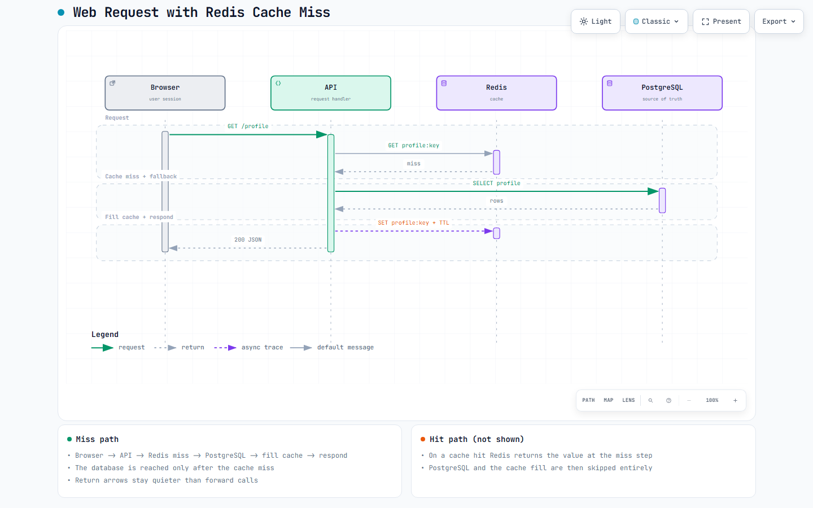

# Video RAG for course playlists

Ask a question about a video course and get a written answer plus the exact
video and timestamp where the topic is explained. If the course does not cover
the topic, the system says so instead of inventing an answer.

```
Question: where can we use hashmaps
Status:   answered
Source:   Hash Tables Explained at 12:43
          https://www.youtube.com/watch?v=abc12345678&t=763s

Question: how does kubernetes autoscaling work
Status:   not_covered
          The topic is not covered in the given course
```

## The problem it solves

Students learn from YouTube playlists but rarely take notes, so revision means
scrubbing through hours of video looking for one explanation. Course search on
video platforms matches titles, not spoken content.

This project indexes what is actually said in every video of a playlist, then
answers questions from that content only, always with a timestamp to jump to.

## Folder map

Every file in the project is listed here. Nothing else is hidden anywhere.

```
video-rag/
  backend/            Python service: ingestion, retrieval, API, tests
    src/video_rag/    the application package
    tests/            the test suite
    tools/            test runner that works without pytest
    eval/             threshold calibration harness (add labelled questions here)
    requirements.txt  runtime dependencies
    requirements-dev.txt  test and lint dependencies
    pyproject.toml    package, pytest, ruff and mypy settings
    Dockerfile        production image
  frontend/           the web page: three files, no build step
    index.html        page structure
    styles.css        styling
    app.js            calls the API and renders answers
  docs/               written documentation
    ARCHITECTURE.md   layers, diagrams and design decisions
    EXPLANATION.md    the complete 1-hour walkthrough: architecture,
                      workflows, every library and API, requirements
    WINDOWS.md        Windows setup, step by step
    TROUBLESHOOTING.md  common errors and their fixes
    DEPLOY.md         how to deploy
    INTERVIEW.md      how to present this project
    diagrams/         exported diagrams (PNG plus interactive HTML and spec)
  .env.example        every setting with comments; copy to .env
  .dockerignore       keeps the Docker build context small
  .gitignore          keeps secrets and local data out of git
  docker-compose.yml  API plus Qdrant, one command to start
  README.md           this file
```

Inside `backend/src/video_rag/` the layout mirrors the architecture:

```
core/           pure logic with no external dependencies: url parsing,
                chunking, ranking, timestamps, cleaning, coverage gate
core/ports.py   the interfaces every adapter must satisfy
adapters/       everything that touches the outside world: youtube,
                captions, embedders, vector stores, sqlite, llm
ingest/         use case one: index a course
ask/            use case two: answer one question about one course
api/            http layer: app, routes, request models, auth, jobs
container.py    builds the objects and picks adapters from the settings
config.py       every setting, read from the environment in one place
cli.py          command line entry point
```

## Quick start on Windows

```powershell
python -m venv .venv
.\.venv\Scripts\python.exe -m pip install -r backend\requirements.txt -r backend\requirements-dev.txt
Copy-Item .env.example .env
$env:PYTHONPATH = "backend\src"
.\.venv\Scripts\python.exe -m video_rag.cli smoke
.\.venv\Scripts\python.exe -m video_rag.cli serve
```

Run these commands from the project folder in PowerShell. Before using real
videos, edit `.env` and set `VIDEO_RAG_JINA_API_KEY` (multilingual embeddings)
and `VIDEO_RAG_LLM_API_KEY` (answer writing). The smoke check runs offline and
needs no keys. `serve` starts the app; open <http://127.0.0.1:8000>, paste a
playlist link, wait for indexing, ask a question, and click the timestamp to
watch that moment.

Optional: set `VIDEO_RAG_YOUTUBE_API_KEY` when
`VIDEO_RAG_CATALOG_BACKEND=youtube_data_api`. Full setup details are in
`docs/WINDOWS.md`. If something fails, every common error is listed with its
fix in `docs/TROUBLESHOOTING.md`.

On Linux or macOS the same tasks are three commands:

```bash
python3 -m venv .venv && .venv/bin/pip install -r backend/requirements.txt -r backend/requirements-dev.txt
PYTHONPATH=backend/src .venv/bin/python -m video_rag.cli smoke
VIDEO_RAG_FRONTEND_DIR=frontend PYTHONPATH=backend/src .venv/bin/python -m video_rag.cli serve
```

## How it works, in four layers

1. **Input.** A pasted link is parsed into a video, playlist or channel. The
   playlist is expanded into a video list with ids, titles and durations.
2. **Transcripts.** The fast caption API is tried first, then yt-dlp
   subtitles as fallback; together they cover most videos. Videos with
   no subtitle tracks at all are marked failed and skipped. Word level
   timings are kept untouched: they are the source of truth for every
   timestamp shown later.
3. **Storage.** Transcripts are split into overlapping windows of about a
   minute that never cross a sentence boundary. Each chunk stores its video id,
   its start second and its text, then is embedded and written to the vector
   store with the course id attached.
4. **Answering.** A question is embedded, the top chunks for that one course are
   retrieved and reranked, and a threshold decides the outcome: answer, answer
   with a caveat, or refuse. The winning chunk supplies the video link and the
   timestamp.

The refusal is a rule in code, not a request to a model, which is what makes it
reliable. `docs/ARCHITECTURE.md` has the diagrams and the reasoning.

## Diagrams

Example request flow, generated with Archify from a typed JSON spec
(`docs/diagrams/web-request-cache-miss.sequence.json`):



Browser calls the API, the API checks Redis, and on a cache miss PostgreSQL
is queried and the cache is filled before responding. The interactive version
with pan/zoom, themes and export is in
[`docs/diagrams/web-request-cache-miss.html`](docs/diagrams/web-request-cache-miss.html) —
GitHub renders the PNG above inline; open the HTML locally (or via GitHub
Pages) for the interactive diagram.

## HTTP API

| Method | Path | Purpose |
| --- | --- | --- |
| POST | `/ingest` | Start indexing a video, playlist or channel. Returns a job id. |
| GET | `/jobs/{job_id}` | Poll indexing progress. |
| GET | `/jobs/{job_id}/stream` | Same progress as server sent events. |
| POST | `/ask` | Ask one question about one course. |
| POST | `/ask/stream` | Same answer as `/ask`, streamed token by token over SSE. |
| POST | `/translate` | Translate a generated answer into a selected language using the configured LLM. |
| GET | `/courses` | List indexed courses with video and chunk counts. |
| GET | `/courses/{course_id}/videos` | List the videos of one course. |
| GET | `/courses/{course_id}/syllabus` | List what the course contains. |
| GET | `/health` | Liveness plus which backends are active. |

Interactive documentation is served at `/docs` outside production.

`POST /translate` accepts `{"answer": "...", "target_language": "Hindi"}`.
It uses the same configured language-model API key and API-key authentication
as the other protected routes; citations remain displayed separately from the
translated answer.

## Configuration

Every setting is an environment variable prefixed with `VIDEO_RAG_`, documented
with comments in `.env.example`. Copy that file to `.env` to change anything.
The defaults run the whole system locally with no external service.

The two settings that matter most are the coverage thresholds
`VIDEO_RAG_THRESHOLD_HIGH` and `VIDEO_RAG_THRESHOLD_LOW`. They decide when the
system answers and when it refuses. The shipped values are placeholders. Label a few questions in `backend/eval/`
and extend `eval/run_eval.py` to sweep thresholds against them.

## Tests

```powershell
$env:PYTHONPATH = "backend\src"
.\.venv\Scripts\python.exe -m pytest backend\tests
```

47 tests cover URL parsing, chunk boundaries, timestamp refinement, retrieval and
ranking, the coverage gate, the answering service (video scoping, streaming,
answer-language mirroring), the library listing, the registry rows ingestion
writes, and the refusal behaviour. They use fake adapters, so the suite runs
offline in a few seconds and never calls YouTube.

`.\.venv\Scripts\python.exe -m video_rag.cli smoke` is the end to end check: it
indexes two fake videos, asks a covered question and an uncovered one, and
asserts both outcomes.

## Deployment

`docker compose up --build` starts the API, the web page and a real Qdrant
instance. `docs/DEPLOY.md` covers that plus a single container deployment and
the production checklist.

## Honest limitations

- Embeddings come from the Jina hosted API (multilingual), so real indexing
  and asking need network and a `JINA_API_KEY`. Without one the system boots
  with a toy hashing embedder that is only good for tests. Retrieval, ranking,
  refusal and timestamps do not depend on any local model.
- A language model key is required, not optional: the backend refuses to start
  without `LLM_API_KEY`. It writes the answers, verifies the gray zone and
  localizes refusals.
- Transcripts come from the caption API. The yt-dlp subtitle fallback exists
  in the code path but its parser is not configured, so videos without any
  caption-API tracks are skipped. A one hour video with captions indexes in
  well under a minute.
