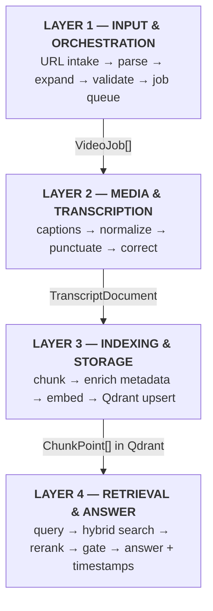
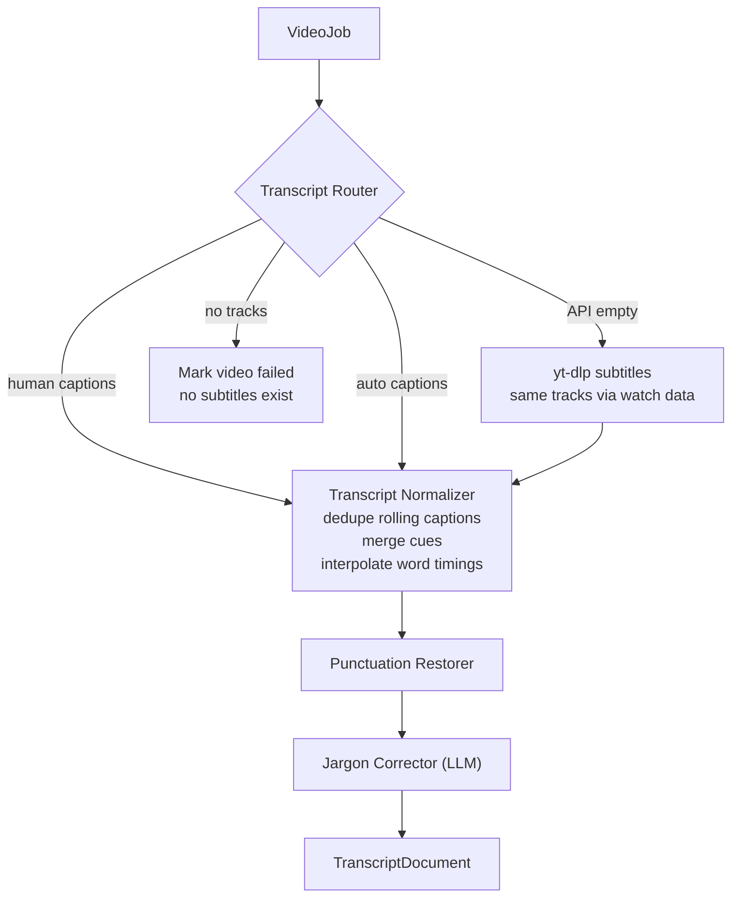
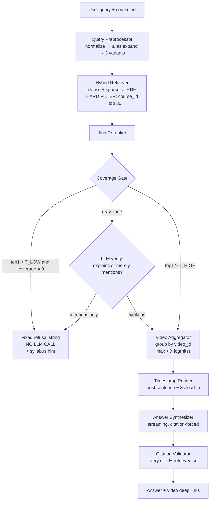
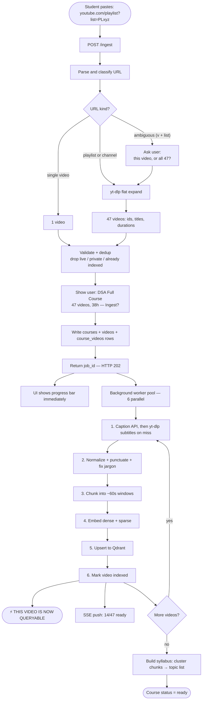
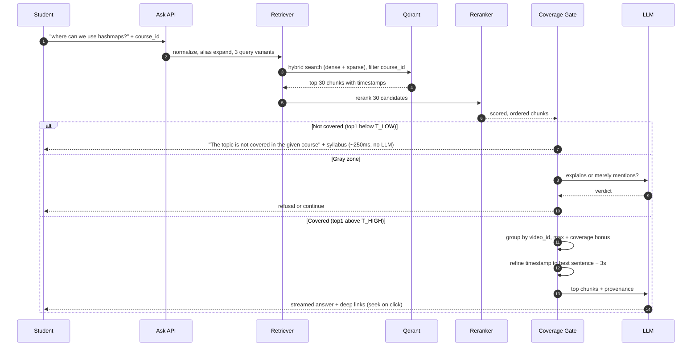

# Video RAG — Technical Architecture

**Project:** Course-scoped question answering over video lectures, with timestamp-accurate citations.

| | |
|---|---|
| **Document version** | v1.1 |
| **Last updated** | 2026-10-01 |
| **Status** | Implemented (subset); deviations from the v1.0 text are listed below and marked inline |

---

## Implementation status (2026-10-01)

The system described below is built and running, with these deviations from
the v1.0 design wording:

- The LLM is **required**: the backend refuses to start without
  `LLM_API_KEY`. There is no extractive fallback; only refusals avoid the LLM.
- Retrieval is dense + lexical keyword search per scope, unioned and deduped,
  then reranked. The RRF helper (`core/fusion.py`) exists but the plain union
  is what ships; BM25/SPLADE is not deployed.
- Query preprocessing is normalization + light stemming/aliasing inside the
  scorers; the 3-variant LLM query rewrite is not implemented.
- Transcripts come from the caption API. The yt-dlp subtitle fallback exists
  in the path but its parser is not configured. There is no disk transcript
  cache yet.
- Punctuation restoration and jargon correction adapters exist behind flags
  (`PUNCTUATION_ENABLED`, `TERMINOLOGY_CORRECTION_ENABLED`), off by default
  and not wired into ingestion.
- The syllabus endpoint returns the course's video titles; the cluster+LLM
  topic syllabus is not built.
- Ingestion writes vectors, publishes job progress (the total is set once
  the catalog is expanded), and records `courses`/`videos`/`course_videos`
  rows in the SQLite registry, so the Library lists fresh ingests. Per-video
  status follows `pending → indexing → indexed/failed`; failures never abort
  the job and registry write problems are logged, never fatal.
- The frontend is three plain files (no Next.js): it polls `/jobs/{id}`
  (an `EventSource` cannot send `X-API-Key`) and consumes `POST /ask/stream`
  SSE for true token streaming.

---

## Table of contents

1. [Problem statement](#1-problem-statement)
2. [Design principles](#2-design-principles)
3. [System overview](#3-system-overview)
4. [Layer 1 — Input & Orchestration](#4-layer-1--input--orchestration)
5. [Layer 2 — Media & Transcription](#5-layer-2--media--transcription)
6. [Layer 3 — Indexing & Storage](#6-layer-3--indexing--storage)
7. [Layer 4 — Retrieval & Answer](#7-layer-4--retrieval--answer)
8. [Workflow A — Ingestion](#8-workflow-a--ingestion)
9. [Workflow B — Query](#9-workflow-b--query)
10. [Data contracts](#10-data-contracts)
11. [Technology stack](#11-technology-stack)
12. [Performance characteristics](#12-performance-characteristics)
13. [Evaluation strategy](#13-evaluation-strategy)
14. [Repository layout](#14-repository-layout)
15. [Build phases](#15-build-phases)
16. [Open decisions](#16-open-decisions)

---

## 1. Problem statement

Students learn from YouTube lectures but rarely take notes. When revising, they must scrub through hours of video hunting for the moment a concept was explained.

This system ingests a course (a playlist, channel, or single video) and answers natural-language questions **using only that course's content**. Each answer returns:

- a synthesized answer grounded in the transcripts
- the specific video that explains the topic
- a timestamp deep link that seeks to the exact moment
- an explicit refusal when the topic is not covered by the course

### In scope (v1)

- YouTube single videos, playlists, and channels
- Transcript-based (speech) retrieval
- Course-scoped closed-domain QA with mandatory abstention
- Sentence-level timestamp precision
- Local-first storage

### Out of scope (v1)

| Deferred | Reason |
|---|---|
| Live-stream / streaming ASR | Different architecture; incremental indexing over an open stream |
| Visual frame understanding (slide OCR, diagram search) | Speech carries ~90% of the signal for lecture content |
| Multi-user auth and cloud sync | Local-first is the v1 privacy story |
| Cross-course search | Designed for (single collection + filter), disabled by default for precision |

---

## 2. Design principles

These are the non-negotiables. Every design decision below traces back to one of them.

| # | Principle | Consequence |
|---|---|---|
| 1 | **Abstention is a code decision, not a model decision** | The refusal string is returned by Python before any LLM is invoked |
| 2 | **Timing truth is immutable** | Raw word-level timings are the only source of timestamps; cleaned text never produces a timestamp |
| 3 | **Every chunk knows where it came from in time** | No chunk may exist without `video_id`, `start_sec`, `end_sec` |
| 4 | **One contract per layer boundary** | Layer 2 does not know what a vector is; Layer 4 does not know what YouTube is |
| 5 | **Ingestion is idempotent and resumable** | Deterministic point IDs; per-video status machine |
| 6 | **Perceived realtime beats batch completeness** | A video becomes queryable the moment *it* is indexed, not when the course finishes |
| 7 | **Measure before optimizing** | Eval sets are committed alongside source code, not bolted on later |

---

## 3. System overview

Four layers, each with a single hard contract to the next.



<details>
<summary>ASCII version</summary>

```
┌─────────────────────────────────────────────────────────────────┐
│  LAYER 1 — INPUT & ORCHESTRATION                                │
│  URL intake → parse → expand → validate → job queue → progress  │
└────────────────────────────┬────────────────────────────────────┘
                             │  contract: VideoJob[]
┌────────────────────────────▼────────────────────────────────────┐
│  LAYER 2 — MEDIA & TRANSCRIPTION                                │
│  captions → normalize → punctuate → correct                       │
└────────────────────────────┬────────────────────────────────────┘
                             │  contract: TranscriptDocument
┌────────────────────────────▼────────────────────────────────────┐
│  LAYER 3 — INDEXING & STORAGE                                   │
│  chunk → enrich metadata → embed (dense + sparse) → Qdrant      │
└────────────────────────────┬────────────────────────────────────┘
                             │  contract: ChunkPoint[] in Qdrant
┌────────────────────────────▼────────────────────────────────────┐
│  LAYER 4 — RETRIEVAL & ANSWER                                   │
│  query → hybrid search → rerank → GATE → answer + timestamps    │
└─────────────────────────────────────────────────────────────────┘
```

</details>

---

## 4. Layer 1 — Input & Orchestration

**Responsibility:** turn one pasted string into a validated, deduplicated, resumable list of work items — and return control to the user immediately.

### Components

| Component | Tool | Input → Output |
|---|---|---|
| Intake API | FastAPI `POST /ingest` | URL → `job_id` (HTTP 202) |
| URL Parser | `urllib.parse` | URL → `{kind, video_id, playlist_id}` |
| Playlist Expander | `yt-dlp` flat mode | `playlist_id` → video metadata list |
| Validation Gate | custom | filters private / deleted / live / over-length |
| Dedup Resolver | SQLite lookup | drops `video_id`s already indexed |
| Course Registry | SQLite | persists `courses`, `videos`, `course_videos` |
| Job Dispatcher | `asyncio` + semaphore | fans out to Layer 2, concurrency-capped |
| Progress Channel | SSE | `GET /ingest/{job_id}/stream` → `14/50 indexed` |

### Supported URL shapes

| Pasted URL | Interpretation |
|---|---|
| `youtube.com/watch?v=ABC` | single video |
| `youtu.be/ABC` | single video (short form) |
| `youtube.com/shorts/ABC` | single video |
| `youtube.com/playlist?list=PLxyz` | whole playlist |
| `youtube.com/watch?v=ABC&list=PLxyz` | **ambiguous — must ask the user** |
| `youtube.com/@channel/videos` | whole channel |

### Key decisions

- **Ambiguity is resolved by asking, not guessing.** `watch?v=X&list=Y` is what you get when someone copies the address bar mid-lecture. The API returns a clarification prompt: *"Ingest just this video, or all 47 videos in 'DSA Full Course'?"*
- **Per-video status machine** — `pending → transcribing → chunked → indexed → failed`. A crash at video 38 of 50 costs one video, not 37.
- **Dedup at the video level, not the course level.** The same lecture appears in multiple playlists routinely. Transcribe and embed once; link many times through the `course_videos` join table.
- **Confirmation before commitment.** The parsed course (title, video count, total runtime) is shown to the user before any transcription work begins.

---

## 5. Layer 2 — Media & Transcription

**Responsibility:** produce accurate text with trustworthy word-level timings. This layer absorbs all the messiness of the outside world.



<details>
<summary>ASCII version</summary>

```
                    ┌──────────────────────┐
   VideoJob ───────▶│  Transcript Router   │
                     └──────┬────────┬──────┘
                     human  │        │  none available
                   captions │        │  → mark video failed
               auto-captions│        │    (captions are the
                            │        │     only source)
                            ▼        ▼
                     ┌────────────────────────────┐
                     │   Transcript Normalizer    │
                     │  dedupe rolling captions   │
                     │  merge cues                │
                     │  interpolate word timings  │
                    └─────────────┬──────────────┘
                                  ▼
                    ┌────────────────────────────┐
                    │   Punctuation Restorer     │
                    └─────────────┬──────────────┘
                                  ▼
                    ┌────────────────────────────┐
                    │   Jargon Corrector (LLM)   │
                    └─────────────┬──────────────┘
                                  ▼
                        TranscriptDocument
```

</details>

### Components

| Component | Tool | Notes |
|---|---|---|
| Transcript Router | `youtube-transcript-api` | prefers human > auto captions |
| Subtitle fallback | `yt-dlp` subtitles | same tracks via watch data, runs only when the API returns nothing |
| Normalizer | custom | dedupe, merge, word-time interpolation |
| Punctuation Restorer | `deepmultilingualpunctuation` | optional extra, off by default |
| Jargon Corrector | any cheap LLM | adapter present; not wired into ingestion yet |
| Transcript Cache | — | not implemented; transcripts are re-fetched on re-index |

### The transcript quality ladder

```
Does the video have human-written captions?
   YES → use them. Best quality, ~1 second.
   NO  → Are auto-captions available via the caption API?
           YES → use them, then clean aggressively
           NO  → try yt-dlp subtitles (same tracks, different route)
                 STILL NOTHING → mark the video failed and skip it
```

Auto-captions are more accurate than their reputation on plain English speech. Their real defects are specific and fixable:

1. **No punctuation or capitalization** — one endless run-on sentence
2. **Mangled technical terms** — `hashmap` → `hash map`, `O(n log n)` → `oh of n log n`, `Dijkstra` → `extra`
3. **Rolling-window duplication** — consecutive cues repeat overlapping text as the on-screen caption scrolls
4. **Accent sensitivity** — a material issue for non-US educational content

**Reframe:** a RAG system does not need verbatim perfection. It needs correct *meaning* and correct *technical terms*, because jargon is exactly what students type into the search box. Cleanup effort is therefore targeted at jargon, not at prose polish.

### Cleanup pipeline

| Step | Mechanism | Why |
|---|---|---|
| 1. Dedupe | compare each cue's prefix to previous cue's suffix | removes rolling-caption repetition |
| 2. Merge | concatenate cues into continuous text | 2–4 word cues are too small to embed |
| 3. Restore punctuation | local punctuation model | unpunctuated text embeds measurably worse |
| 4. Correct jargon | LLM pass with video title as context | `"Fix transcription errors in technical terms only. Do not reword."` |

### Critical invariant: dual transcripts

```
raw_words   →  messy text, exact word-by-word timings   →  SOURCE OF TIMING TRUTH
clean_text  →  punctuated, corrected                    →  SOURCE OF SEMANTIC TRUTH
```

Cleanup can reword or drop text, which would silently corrupt timestamps. Timing must therefore **never** be derived from `clean_text`. Every downstream timestamp traces back to a word in `raw_words`.

### Word-time interpolation

Captions give 2–4 second cues, not word timings. Interpolate within each cue proportionally to character length:

```python
def words_with_times(cue):
    words = cue["text"].split()
    total = sum(len(w) for w in words) or 1
    t, out = cue["start"], []
    for w in words:
        out.append({"word": w, "start": t})
        t += cue["duration"] * len(w) / total
    return out
```

Error is bounded by cue length (2–4s), well inside the ±15s accuracy target.

### Cache versioning

`pipeline_version` participates in the cache key. Improving the cleaner later triggers selective re-indexing rather than a full rebuild.

---

## 6. Layer 3 — Indexing & Storage

**Responsibility:** convert transcripts into searchable points where every point knows exactly where it came from in time.

### Components

| Component | Tool | Configuration |
|---|---|---|
| Semantic Chunker | custom | ~60s windows, ~15s overlap, never splits mid-sentence |
| Metadata Enricher | custom | attaches course/video/time provenance |
| Dense Embedder | Jina `jina-embeddings-v3` | 1024-dim, multilingual, hosted API |
| Sparse Encoder → replaced by | lexical keyword scoring over course-scoped points | jargon matching without a trained model (BM25/SPLADE deferred) |
| Upsert Manager | `qdrant-client` | deterministic IDs → idempotent |
| Syllabus Builder (v1) | video titles from the registry | interpretable scope hint; cluster+LLM topics deferred |
| Alias handling | normalization table in ranking/cleaning code | `hashmap ↔ hash table ↔ hash map`; no SQLite alias table yet |

### Qdrant point structure

```json
{
  "id": "sha1(video_id + start_sec + pipeline_version)",
  "vector": {
    "dense": [0.021, -0.117, "...384 dims"],
    "sparse": { "indices": [104, 2288], "values": [0.71, 0.42] }
  },
  "payload": {
    "course_id": "PLxyz",
    "video_id": "dQw4w9WgXcQ",
    "video_title": "Hash Tables Explained",
    "position": 12,
    "start_sec": 412,
    "end_sec": 470,
    "text": "So a hashmap gives you O(1) lookup, which is why we use it for caching...",
    "sentences": [
      { "t": 412, "s": "So a hashmap gives you O(1) lookup" },
      { "t": 418, "s": "which is why we use it for caching" }
    ]
  }
}
```

### Three decisions worth defending

**1. One collection, filtered by `course_id` — not a collection per course.**
A payload index on `course_id` lets Qdrant filter pre-search at near-zero cost. Collection-per-course would mean thousands of collections, no path to optional cross-course search, and painful operations.

**2. `sentences[]` stored in the payload.**
This is what enables sentence-level timestamp refinement in Layer 4 without a second database round trip.

**3. Deterministic point IDs.**
Re-running ingestion overwrites rather than duplicates. Idempotency is a storage-layer property, not a caller concern.

### Syllabus generation

After all videos in a course are indexed, cluster the chunks and generate a compact topic list:

```json
{
  "course_id": "PLxyz",
  "topics": ["arrays", "linked lists", "stacks & queues",
              "recursion", "sorting algorithms", "binary search"]
}
```

This serves three purposes:

1. A fast, interpretable scope pre-check before hitting the vector DB
2. Materially better refusals — *"...This course covers: arrays, linked lists, recursion, sorting"*
3. A UI element that sets user expectations and prevents most out-of-scope queries from being typed

> ⚠️ The syllabus is coarse. Use it to **route**, never to **reject**. A course can cover material that did not make a 20-item topic list. Rejection happens only at the full coverage gate.

---

## 7. Layer 4 — Retrieval & Answer

**Responsibility:** answer from the course only, cite exact moments, and refuse fast when the topic is absent.



<details>
<summary>ASCII version</summary>

```
                        user query + course_id
                                 │
                                 ▼
                  ┌──────────────────────────────┐
                  │   Query Preprocessor         │
                  │   normalize → alias expand   │
                  │   → 3 query variants         │
                  └──────────────┬───────────────┘
                                 ▼
                  ┌──────────────────────────────┐
                  │   Hybrid Retriever           │
                  │   dense + sparse → RRF       │
                  │   HARD FILTER: course_id     │  ← scope guarantee
                  │   → top 30 chunks            │
                  └──────────────┬───────────────┘
                                 ▼
                  ┌──────────────────────────────┐
                  │   Jina Reranker              │
                  └──────────────┬───────────────┘
                                 ▼
                  ┌──────────────────────────────┐
                  │      COVERAGE GATE           │
                  │  top1 >= T_HIGH → covered    │
                  │  top1 <  T_LOW  → not covered│
                  │  else → LLM verify           │
                  └───────┬──────────────┬───────┘
              not covered │              │ covered
                          ▼              ▼
        ┌─────────────────────┐   ┌──────────────────────────┐
        │ Fixed string,       │   │  Video Aggregator        │
        │ no LLM call         │   │  group by video_id       │
        │                     │   │  max + coverage bonus    │
        │ "The topic is not   │   └────────────┬─────────────┘
        │  covered in the     │                ▼
        │  given course"      │   ┌──────────────────────────┐
        │ + syllabus hint     │   │  Timestamp Refiner       │
        └─────────────────────┘   │  best sentence − 3s      │
                                  └────────────┬─────────────┘
                                               ▼
                                  ┌──────────────────────────┐
                                  │  Answer Synthesizer      │
                                  │  streaming, cite-forced  │
                                  └────────────┬─────────────┘
                                               ▼
                                  ┌──────────────────────────┐
                                  │  Citation Validator      │
                                  └────────────┬─────────────┘
                                               ▼
                                    answer + deep links
```

</details>

### Components

| Component | Tool |
|---|---|
| Query Preprocessor | alias index + optional LLM rewrite |
| Hybrid Retriever | Qdrant dense + sparse, RRF fusion |
| Reranker | Jina `jina-reranker-v2-base-multilingual` | multilingual, hosted API |
| Coverage Gate | score thresholds + gray-zone LLM check |
| Video Aggregator | `max_score + λ·log(matching_chunks)` |
| Timestamp Refiner | sentence-level similarity within winning chunk |
| Synthesizer | streaming LLM, citations mandatory |
| Citation Validator | custom guard |

### Why threshold on rerank score, not cosine similarity

Raw embedding similarity is **uncalibrated**. An irrelevant chunk often scores 0.72 while a perfect match scores 0.79 — there is no stable cutoff across queries. The reranker scores query and chunk text jointly with saturating term statistics, producing far more comparable scores in 0.0–1.0. This is the second, larger reason to include a reranker beyond ranking quality.

### The coverage gate

```python
def gate(query, chunks):
    scores = lexical_reranker.score(query, chunks)   # top ~20-30 chunks
    top1 = scores[0]
    coverage = sum(s > T_LOW for s in scores)

    if top1 >= T_HIGH:
        return "covered"
    if top1 < T_LOW and coverage == 0:
        return "not_covered"        # cheap, confident, no LLM
    return "verify"                 # gray zone → one small LLM call
```

Three signals inform the decision:

| Signal | Role |
|---|---|
| Rerank score of best chunk | primary evidence |
| Coverage across chunks | a genuinely-taught topic spans several chunks; a lone high scorer is often a passing mention |
| Lexical presence | strong **positive** signal; deliberately **not** used to reject |

> ⚠️ Lexical absence must not trigger rejection. A Python course may teach hashmaps entirely as "dictionaries" and never say "hashmap". Lexical hits boost confidence only.

**Gray-zone verification prompt:**

> *"Here is a transcript excerpt from a course. Question: {query}. Does this excerpt actually **explain** the concept asked about, or merely **mention** it in passing? Answer JSON: `{"explains": bool, "confidence": 0-1}`"*

The explain-versus-mention distinction is what prevents a throwaway line — *"hashmaps are like arrays but faster"* in an arrays lecture — from being treated as coverage.

### Recall protection (avoiding over-refusal)

Falsely refusing a covered topic is the worse failure mode: it makes the tool feel broken and users stop trusting it. Recall is therefore maximized *before* the gate:

- **Multi-query expansion** — rewrite into 3 variants (`"where can we use hashmaps"` → `"hashmap applications"`, `"when to use a hash table"`), retrieve for all, union results
- **Alias/synonym map** — per-domain; ~60 entries covers a DSA course
- **Aggressive normalization** — lowercase, strip punctuation, stem, collapse caption variants (`hash map` → `hashmap`, `big oh` → `big o`)

### Video aggregation

The best-matching *chunk* is not always in the best-matching *video*. A one-line mention of hashmaps in a caching lecture can out-score the dedicated hashmap video on a single chunk.

```
video_score = max(chunk_scores) + λ · log(count of matching chunks)
```

The coverage term is what lets the dedicated video win — it has *many* relevant chunks, not one.

### Timestamp refinement

Chunks are ~60s wide. Landing a user 45 seconds early feels broken. Second pass:

1. Take the winning chunk's `sentences[]` from the payload
2. Score each sentence against the query
3. Use the best sentence's `t`, minus ~3s of lead-in

This is the difference between a demo that feels precise and one that feels approximate.

### Response contracts

**Answered:**

```json
{
  "status": "answered",
  "answer": "Hashmaps are used for caching, deduplication, and frequency counting...",
  "primary_source": {
    "video_title": "Hash Tables Explained",
    "url": "https://youtube.com/watch?v=dQw4w9WgXcQ&t=409s",
    "timestamp": "6:49"
  },
  "also_mentioned_in": [
    { "video_title": "Caching Strategies", "url": "...&t=1204s", "timestamp": "20:04" }
  ]
}
```

**Not covered:**

```json
{
  "status": "not_covered",
  "message": "The topic is not covered in the given course",
  "course_covers": ["arrays", "linked lists", "recursion", "sorting"]
}
```

**Partially covered** (third state, deliberately distinct):

```json
{
  "status": "partial",
  "message": "This topic is only briefly mentioned in the course and is not covered in depth.",
  "primary_source": { "video_title": "Arrays", "url": "...&t=724s", "timestamp": "12:04" }
}
```

---

## 8. Workflow A — Ingestion

**What the user gives, and what happens when they give it.**



<details>
<summary>ASCII version</summary>

```
 STUDENT
    │  pastes: youtube.com/playlist?list=PLxyz
    ▼
┌────────────────────────────────────────────────┐
│  POST /ingest                                  │
└────────────────────┬───────────────────────────┘
                     ▼
              parse & classify URL
                     │
         ┌───────────┴───────────┐
      single video           playlist / channel
         │                       │
         │                       ▼
         │              yt-dlp flat expand
         │              (47 videos, titles,
         │               durations)
         └───────────┬───────────┘
                     ▼
            validate + dedup
         (drop live/private/indexed)
                     ▼
      ┌──────────────────────────────────┐
      │  SHOW USER: "DSA Full Course —   │
      │  47 videos, 38h. Ingest?"        │
      └──────────────┬───────────────────┘
                     │ confirm
                     ▼
        write courses + videos rows
                     ▼
        return job_id  ──────────────────▶ HTTP 202, UI shows progress bar
                     │
                     ▼
     ╔═══════════════════════════════════════════╗
     ║  BACKGROUND WORKERS  (6 in parallel)      ║
     ║                                           ║
║  for each video:                                    ║
║    ① caption API ─miss─▶ yt-dlp subtitles            ║
║    ② normalize + punctuate + fix jargon             ║
     ║    ③ chunk into ~60s windows              ║
     ║    ④ embed dense + sparse                 ║
     ║    ⑤ upsert to Qdrant                     ║
     ║    ⑥ mark video 'indexed'                 ║
     ║         │                                 ║
     ║         └──▶ SSE push: "14/47 ready"      ║
     ║              ⚡ VIDEO IS NOW QUERYABLE     ║
     ╚═══════════════════════════════════════════╝
                     ▼
        after all done: build syllabus
        (cluster chunks → topic list)
                     ▼
              course status = ready
```

</details>

**The load-bearing detail:** step 6 marks each video queryable the moment *it* finishes. The student asks questions about lecture 1 while lecture 47 is still transcribing. This is what makes a 38-hour course feel like it loaded instantly.

---

## 9. Workflow B — Query

**How the system processes a particular query, in realtime.**



<details>
<summary>ASCII version</summary>

```
 STUDENT: "where can we use hashmaps?"   [course: DSA Full Course]
    │
    ▼
┌─────────────────────────────────────────────────────────┐
│ POST /ask  { query, course_id }                         │
└────────────────────────┬────────────────────────────────┘
                         ▼
        ┌────────────────────────────────────┐
        │ expand aliases + 3 query variants  │
        │  • where can we use hashmaps       │
        │  • hashmap applications            │
        │  • when to use a hash table        │
        └────────────────┬───────────────────┘
                         ▼
        ┌────────────────────────────────────┐
        │ Qdrant hybrid search               │
        │ filter: course_id = PLxyz  ◀── scope lock
        │ dense ∪ sparse → RRF → top 30      │
        └────────────────┬───────────────────┘
                         ▼
              cross-encoder rerank
                         ▼
              ╔══════════════════════╗
              ║    COVERAGE GATE     ║
              ╚═══╦══════════════╦═══╝
        NOT COVERED│              │COVERED
                   ▼              ▼
    ┌──────────────────────┐   group chunks by video_id
    │ "The topic is not    │   score = max + λ·log(hits)
    │  covered in the      │              ▼
    │  given course"       │   winner: "Hash Tables
    │                      │            Explained"
    │ This course covers:  │   (4 matching chunks)
    │ arrays, linked lists,│              ▼
    │ recursion, sorting   │   refine timestamp:
    │                      │   best sentence @ 412s
    │  ⚡ ~250ms, no LLM    │   → seek 409s
    └──────────────────────┘              ▼
                               stream answer with
                               forced citations
                                          ▼
                               validate every citation
                               exists in retrieved set
                                          ▼
                          ┌───────────────────────────────┐
                          │ ANSWER (streamed)             │
                          │ "Hashmaps are used for..."    │
                          │                               │
                          │ ▶ Hash Tables Explained 6:49  │
                          │ ▶ Caching Strategies  20:04   │
                          │                               │
                          │ [player seeks on click]       │
                          └───────────────────────────────┘
```

</details>

---

## 10. Data contracts

### Layer 1 → Layer 2: `VideoJob`

```json
{
  "video_id": "dQw4w9WgXcQ",
  "course_id": "PLxyz",
  "title": "Hash Tables Explained",
  "description_snippet": "We cover hashing, collisions, and load factor...",
  "chapters": ["Intro", "Hash functions", "Collision handling"],
  "duration_sec": 3412,
  "position": 12
}
```

### Layer 2 → Layer 3: `TranscriptDocument`

```json
{
  "video_id": "dQw4w9WgXcQ",
  "title": "Hash Tables Explained",
  "duration_sec": 3412,
  "transcript_source": "auto_captions",
  "pipeline_version": "v1.2",
  "raw_words": [
    { "word": "so", "start": 411.8 },
    { "word": "a", "start": 412.0 },
    { "word": "hashmap", "start": 412.3 }
  ],
  "clean_text": "So a hashmap gives you O(1) lookup, which is why we use it for caching."
}
```

### SQLite registry schema

```sql
CREATE TABLE courses (
  course_id      TEXT PRIMARY KEY,
  source_url     TEXT NOT NULL,
  title          TEXT,
  video_count    INTEGER,
  status         TEXT CHECK(status IN ('pending','ingesting','ready','failed')),
  syllabus_json  TEXT,
  created_at     TIMESTAMP DEFAULT CURRENT_TIMESTAMP
);

CREATE TABLE videos (
  video_id          TEXT PRIMARY KEY,
  title             TEXT,
  duration_sec      INTEGER,
  transcript_source TEXT CHECK(transcript_source IN
                      ('human_captions','auto_captions')),
  pipeline_version  TEXT,
  status            TEXT CHECK(status IN
                      ('pending','transcribing','chunked','indexed','failed')),
  error             TEXT,
  indexed_at        TIMESTAMP
);

CREATE TABLE course_videos (
  course_id  TEXT REFERENCES courses(course_id),
  video_id   TEXT REFERENCES videos(video_id),
  position   INTEGER,
  PRIMARY KEY (course_id, video_id)
);

CREATE TABLE aliases (
  domain     TEXT,
  canonical  TEXT,
  variant    TEXT,
  PRIMARY KEY (domain, variant)
);

CREATE INDEX idx_videos_status ON videos(status);
```

The `course_videos` join table is what makes video-level dedup possible: one transcription, many course memberships.

### Tunable configuration

| Parameter | Default | Meaning |
|---|---|---|
| `CHUNK_WINDOW_SEC` | 60 | target chunk duration |
| `CHUNK_OVERLAP_SEC` | 15 | overlap between adjacent chunks |
| `RETRIEVE_TOP_K` | 30 | candidates fetched before reranking |
| `T_HIGH` | calibrated | rerank score above which coverage is assumed |
| `T_LOW` | calibrated | rerank score below which refusal is immediate |
| `LAMBDA_COVERAGE` | calibrated | weight of chunk-count bonus in video scoring |
| `INGEST_CONCURRENCY` | 6 | parallel video workers |
| `LEAD_IN_SEC` | 3 | seconds subtracted from refined timestamp |

`T_HIGH`, `T_LOW`, and `LAMBDA_COVERAGE` must be calibrated empirically — see [§13](#13-evaluation-strategy).

---

## 11. Technology stack

| Concern | Choice | Why |
|---|---|---|
| API | FastAPI | async native, SSE support, trivial to run locally |
| Playlist / metadata | `yt-dlp` (flat mode) | one call returns full course listing, no media download |
| Existing captions | `youtube-transcript-api` | ~300ms per video, timestamps included, free |
| Punctuation | `deepmultilingualpunctuation` (optional extra, off by default) | local, seconds, no API cost |
| Jargon correction | any cheap LLM | targeted at technical terms only |
| Dense embeddings | Jina `jina-embeddings-v3` | 1024-dim, multilingual via API |
| Sparse retrieval → shipped as | lexical keyword scoring over scoped points | essential for jargon and proper nouns; BM25/SPLADE deferred |
| Vector store | Qdrant via URL (Cloud or self-hosted; local JSON store for dev) | payload filtering, one collection, idempotent upserts |
| Reranking | Jina `jina-reranker-v2-base-multilingual` | multilingual, hosted API |
| Registry | SQLite | zero-config, resumable jobs, ships with the repo |
| Frontend | Plain JS + YouTube IFrame API | three files, no build step; the player seeks to the cited timestamp on click |

### Local-first storage note

Qdrant's hosted free tier sends data off-device. For a local-first student tool, run it embedded:

```python
from qdrant_client import QdrantClient
client = QdrantClient(path="./qdrant_data")   # local, no server, no network
```

Same API surface. Switching to a hosted cluster later is a one-line change for a public demo.

---

## 12. Performance characteristics

> All figures are **ballpark estimates** and must be re-benchmarked on target hardware.

### Ingestion — 1 hour of video, captions available

| Step | Time |
|---|---|
| Fetch captions | ~1 s |
| Clean + punctuate | a few seconds |
| Jargon correction pass (optional) | ~10–30 s |
| Chunk into ~60 windows | instant |
| Embed | a few seconds |
| Upsert to Qdrant | ~1 s |
| **Total** | **~10–40 s** |

A 1-hour lecture is only ~9,000–10,000 words. The embedding workload is trivial.

### Full course — 50 videos, ~40 hours

| Path | Wall clock (6 parallel) |
|---|---|
| Captions | **~1–3 minutes** |

Cost is paid once per video, ever — results are cached and deduped across courses.

### Query latency budget

| Stage | Target |
|---|---|
| Preprocess + alias expand | ~10 ms |
| Embed query (Jina API) | ~100–300 ms |
| Qdrant hybrid search | ~25 ms |
| Rerank 30 candidates (Jina API) | ~0.2–2 s (warm vs cold connection) |
| Coverage gate | ~0 ms (+~400 ms in gray zone) |
| Timestamp refinement | ~15 ms |
| LLM first token | ~400 ms |
| **Time to first token** | **≈ 1–2 s** |
| **Refusal path (no LLM)** | **≈ 250 ms** |

Note the desirable consequence: **refusals are the fastest path in the system.** A student asking something off-syllabus is told instantly.

---

## 13. Evaluation strategy

Eval lives in the repo at the same level as source code. It is part of the system, not an afterthought.

### Two datasets

| Set | Size | Contents |
|---|---|---|
| `positives.jsonl` | ~40 | questions genuinely answered in the course, each labeled with correct `video_id` + timestamp |
| `negatives.jsonl` | ~40 | questions plausibly about the subject but **not taught in this course** |

**Negatives must be adversarial to be meaningful.** For a DSA playlist ending at binary search, good negatives are *"how do red-black trees rebalance"* or *"explain Dijkstra's algorithm"* — same domain, adjacent difficulty. Easy negatives like *"what is photosynthesis"* prove nothing.

### Metrics

| Metric | Definition | Target |
|---|---|---|
| **Recall@3** | correct video appears in top 3 | maximize |
| **Timestamp accuracy** | share of answers landing within ±15s of ground truth | maximize |
| **False refusal rate** | covered topics wrongly refused | minimize (worse UX failure) |
| **False answer rate** | uncovered topics wrongly answered | minimize (trust failure) |

### Threshold calibration

`T_HIGH` and `T_LOW` are swept against both datasets to expose the tradeoff curve between false refusals and false answers. They are never guessed.

### Why this matters beyond correctness

The eval harness produces statements like:

> *"Switching dense search to Jina multilingual embeddings moved Recall@3 from 61% to 84%. Sentence-level timestamp refinement cut median seek error from 28s to 6s. Hallucination rate on out-of-scope queries: 2%, at a 7% false refusal rate."*

This demonstrates identifying the failure mode that matters, building a measurement for it, and tuning against an explicit tradeoff — rather than wiring APIs together and hoping.

---

## 14. Repository layout

```
video-rag/
├── backend/                      the Python service
│   ├── src/video_rag/
│   │   ├── core/                 pure logic, no external dependencies
│   │   │   ├── url_parsing.py    classify a pasted link
│   │   │   ├── chunking.py       sentence aware windows of about a minute
│   │   │   ├── transcript_cleaning.py  tidy caption text, keep the timings
│   │   │   ├── timestamps.py     refine the start second of a match
│   │   │   ├── ranking.py        score chunks, then score videos
│   │   │   ├── fusion.py         merge results from several searches
│   │   │   ├── coverage.py       the abstention gate
│   │   │   ├── models.py         the domain objects
│   │   │   └── ports.py          interfaces every adapter implements
│   │   ├── adapters/             everything that touches the outside world
│   │   │   ├── youtube_catalog.py     yt-dlp playlist expansion
│   │   │   ├── youtube_captions.py    fast caption API
│   │   │   ├── ytdlp_subtitles.py     yt-dlp subtitle fallback
│   │   │   ├── text_processing.py     punctuation and jargon correction
│   │   │   ├── embeddings.py          Jina hosted embedder
│   │   │   ├── reranker.py            lexical and cross encoder
│   │   │   ├── vector_store_memory.py local index
│   │   │   ├── vector_store_qdrant.py production index
│   │   │   ├── sqlite_registry.py     courses and videos
│   │   │   ├── llm.py                 answer wording
│   │   │   └── fakes.py               doubles used by the tests
│   │   ├── ingest/service.py     layers 1 to 3: index a course
│   │   ├── ask/service.py        layer 4: answer one question
│   │   ├── api/                  app, routes, schemas, security, jobs
│   │   ├── container.py          wires the adapters chosen by the settings
│   │   ├── config.py             every setting in one place
│   │   ├── errors.py             the error hierarchy
│   │   ├── logging_config.py     structured logging
│   │   └── cli.py                command line entry point
│   ├── tests/                    47 offline tests using the fakes
│   ├── tools/run_tests.py        runs the suite without pytest installed
│   ├── eval/                     positives, negatives and the threshold sweep
│   ├── requirements.txt
│   ├── requirements-dev.txt
│   ├── pyproject.toml
│   └── Dockerfile
├── frontend/                     index.html, styles.css, app.js
├── docs/                         this document, WINDOWS, DEPLOY, INTERVIEW
├── docker-compose.yml            API plus Qdrant
├── run.ps1, run.cmd              Windows task runners
├── .env.example
└── README.md
```

The split is deliberate. `core/` holds logic that runs with no network, no database and no model, so it is trivial to test. `adapters/` holds everything replaceable. `ingest/` and `ask/` are the two use cases, and `api/` is only transport. Keeping `eval/` beside the tests signals that measurement is part of the system rather than an afterthought.

---

## 15. Build phases

| Phase | Deliverable | Proves |
|---|---|---|
| **v0** | One hardcoded video → captions → chunks → Qdrant → answer with timestamp, in a terminal | the hard part works |
| **v0.5** | Playlist expansion, SQLite registry, parallel workers, SSE progress | it scales to a real course |
| **v1** | Hybrid search + reranker + coverage gate + eval sets | it is accurate and honest |
| **v1.5** | Jargon correction, syllabus generation | it handles messy inputs |
| **v2** | Web UI with a player that seeks on citation click | it is demoable |

**Resist building the UI first.** v0 in a terminal proves retrieval works; the UI is the easy part and is far more satisfying to build once answers are actually good.

---

## 16. Open decisions

| # | Question | Current lean |
|---|---|---|
| 1 | Hard-stop on refusal, or offer opt-in general-knowledge fallback? | **Hard stop by default.** The value proposition is *"everything I tell you is in your course, with a timestamp."* An opt-in button with visually distinct, uncited output is defensible. |
| 2 | Default query scope: selected course, or all ingested content? | **Selected course.** Cross-course search hurts precision badly — "arrays" in a DSA course and a Python basics course yield different answers. Expose an explicit "search everything" toggle. |
| 3 | Run jargon correction on every video, or only on flagged ones? | Start with **every video**; if LLM cost becomes material, gate it on `transcript_source == "auto_captions"`. |
| 4 | Sparse retrieval: BM25 or SPLADE? | Start with **BM25** (no model, no training). Revisit if jargon recall is weak. |
| 5 | Where does the alias map come from? | Hand-authored per domain for v1 (~60 entries for DSA). Later: mine it from transcript vocabulary automatically. |

---

## Appendix — Failure modes and handling

| Failure | Detection | Handling |
|---|---|---|
| No subtitles | both providers raise | mark video failed, continue with the rest |
| Video private / deleted | expansion returns null entry | filter at validation gate, report count to user |
| Live stream | no duration / live flag | reject with explanation |
| Non-English captions only | language list on transcript | fetch and `.translate("en")` |
| Caption API rate limit | HTTP 429 | exponential backoff, cap concurrency at 6–8, disk cache raw responses |
| Worker crash mid-course | video status stuck in `transcribing` | resume from status table; only that video is redone |
| Topic spans many videos | aggregator sees hits across `video_id`s | score union of evidence; return primary + "also mentioned in" |
| Passing mention only | gate gray zone, LLM says "mentions" | return `status: partial` with the moment linked |
| LLM cites a chunk not retrieved | citation validator | strip the citation; if none survive, downgrade to refusal |
