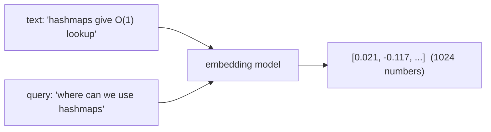
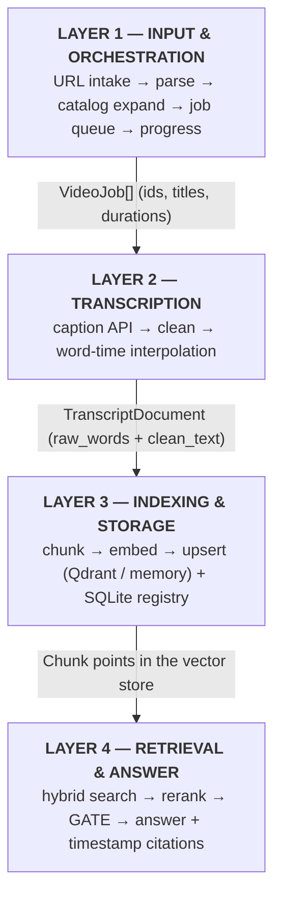
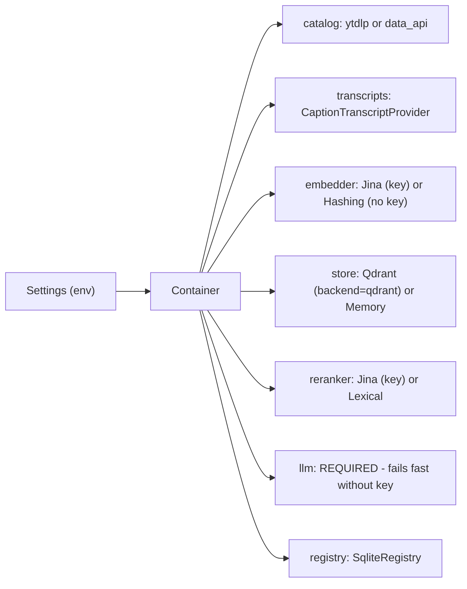
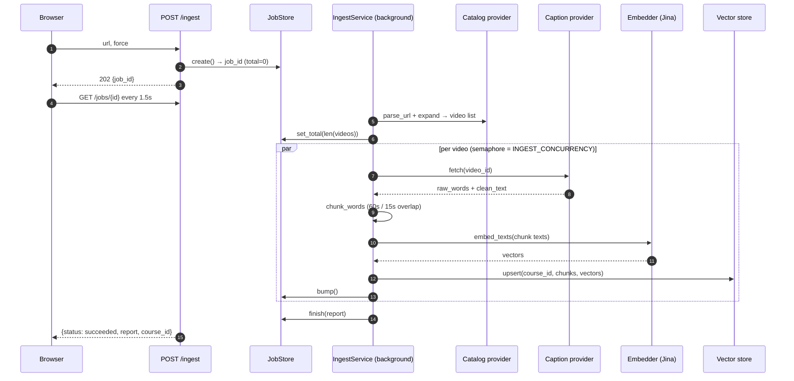
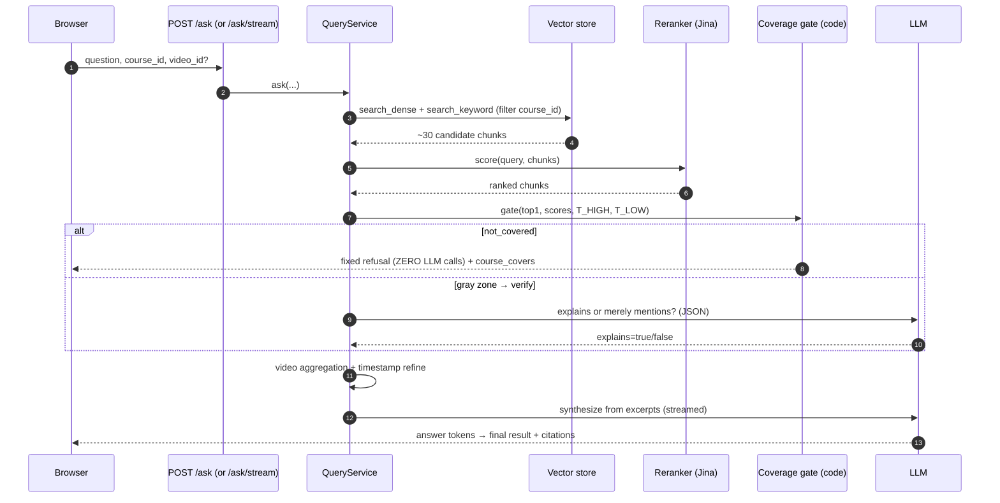

# Video RAG — The Complete Project Explanation

**Audience:** anyone presenting, learning, or reviewing this project — including you, explaining it for a full hour without notes.
**Source of truth:** every statement here matches the code in this repository as of 2026-10-01 (including the YouTube Data API endpoint fix and the ingest progress-bar fix).
**Companion docs:** `README.md` (quick start) · `docs/ARCHITECTURE.md` (design doc) · `docs/INTERVIEW.md` (pitch) · `docs/TROUBLESHOOTING.md` (fixes).

---

## Table of contents

1. [How to use this document (60-minute plan)](#1-how-to-use-this-document)
2. [The problem and the product idea](#2-the-problem-and-the-product-idea)
3. [Prerequisite concepts — a RAG crash course](#3-prerequisite-concepts)
4. [System architecture — the four layers](#4-system-architecture)
5. [Workflow A — ingestion, step by step](#5-workflow-a--ingestion)
6. [Workflow B — answering a question, step by step](#6-workflow-b--answering-a-question)
7. [Repository tour](#7-repository-tour)
8. [Module-by-module deep dive](#8-module-by-module-deep-dive)
9. [Requirements specification](#9-requirements-specification)
10. [Every library, explained](#10-every-library-explained)
11. [Every external API, explained](#11-every-external-api-explained)
12. [Configuration reference](#12-configuration-reference)
13. [Data model and storage](#13-data-model-and-storage)
14. [HTTP API reference](#14-http-api-reference)
15. [The frontend, explained](#15-the-frontend-explained)
16. [Security model](#16-security-model)
17. [Testing strategy](#17-testing-strategy)
18. [Deployment](#18-deployment)
19. [Performance characteristics](#19-performance-characteristics)
20. [Honest limitations and known gaps](#20-honest-limitations-and-known-gaps)
21. [Design decisions and trade-offs](#21-design-decisions-and-trade-offs)
22. [Roadmap](#22-roadmap)
23. [Glossary](#23-glossary)

---

## 1. How to use this document

This document is written to be **spoken aloud for ~60 minutes**. The timing map below shows how to pace a one-hour walkthrough; each section is self-contained, so you can also read any part on its own.

| Minutes | Section | What you cover |
|---|---|---|
| 0–3 | §2 Problem | Why scrubbing YouTube videos is broken; the one-sentence pitch |
| 3–8 | §3 Concepts | Embeddings, vector search, reranking, LLM, RAG — for any audience |
| 8–14 | §4 Architecture | The four layers and the one contract between each |
| 14–24 | §5 Ingestion | URL → catalog → captions → chunks → vectors, live demo narrative |
| 24–38 | §6 Question answering | Retrieval → rerank → gate → cite → stream; the coverage gate math |
| 38–44 | §7–8 Code tour | Folder map and the role of every module |
| 44–50 | §10–11 Dependencies & APIs | Every library and every external service, why each was chosen |
| 50–54 | §12–13 Config & data | Environment settings, SQLite schema, Qdrant point anatomy |
| 54–58 | §15–18 Frontend, security, tests, deploy | The three-file UI, the security rails, 47 offline tests |
| 58–60 | §20–22 Limitations & roadmap | What is not built yet — say it before you are asked |

**Demo cues** are marked 💡 — where to switch to the live app during a presentation.

---

## 2. The problem and the product idea

### 2.1 The pain

Students learn from YouTube playlists — a 40-hour DSA course, a 12-hour Python series. But:

- **Nobody takes timestamps notes.** Three weeks later, "where did he explain hashmaps?" means scrubbing through hours of video.
- **Platform search is useless for spoken content.** YouTube search matches *titles and descriptions*, not what the instructor actually *said* at minute 12.
- **Generic AI chat makes it worse.** Ask ChatGPT about hashmaps and you get an answer from the whole internet — not from *your course*, not at *your lecture's pace*, and with no way to jump to the moment your instructor explained it.

### 2.2 The product

Video RAG indexes **what is spoken** in every video of a course (a single video, a playlist, or a channel), then answers questions **using only that course's content**. Every answer ships with:

1. a written answer grounded in the transcript,
2. the **exact video** that explains the topic,
3. a **timestamp deep link** — `https://www.youtube.com/watch?v=…&t=649s` — that seeks to the moment,
4. and when the course never covers the topic: a **refusal** — a fixed sentence, decided by a rule in code, not a guess by a model.

> The one-sentence pitch: *"Ask a question about your course; get the answer and the exact second it was taught — or an honest 'not covered'."*

### 2.3 Why this is more than "ChatGPT over transcripts"

Three things separate it from a weekend RAG demo, and each gets a deep-dive section:

| Differentiator | Where |
|---|---|
| **Timestamp-accurate citations** — chunk metadata carries video id + start second from creation to citation; word timings are never rewritten | §8.4, §8.9 |
| **Video-level ranking** — a lecture that teaches a topic for 5 minutes outranks a passing mention | §6.6 |
| **Abstention as code** — a threshold gate decides refusal *before* any LLM is invoked; the refusal path costs zero model calls | §6.5 |

---

## 3. Prerequisite concepts

If your audience already knows RAG, present this as a 60-second refresher. Otherwise, this section is the foundation everything else builds on.

### 3.1 Embeddings

An **embedding** is a list of numbers (here, 1,024 of them) that represents the *meaning* of a piece of text. Texts with similar meaning get vectors that point in similar directions. We use **Jina Embeddings v3**, a hosted multilingual model: it places English, Hindi, and Roman-script Hinglish into the same meaning space, which is why a Hindi transcript can be retrieved by an English question.



**Similarity** between two vectors is **cosine similarity** — the cosine of the angle between them: 1.0 = same direction (same meaning), 0.0 = unrelated. The vector store does this comparison at scale.

### 3.2 Vector store

A database that stores vectors *plus arbitrary metadata* (our `course_id`, `video_id`, timestamps, text) and answers "which stored vectors are closest to this query vector?" — with a **filter** applied *before* the search (that filter is how course isolation is enforced: `course_id = PLxyz`).

We support two interchangeable backends behind one interface:

- **Qdrant** (production; cloud or self-hosted) — real ANN search.
- **A local JSON memory store** (dev/tests) — same interface, brute-force cosine in Python, no services needed.

### 3.3 Keyword (lexical) search

Vectors are great at meaning, weak at exact jargon ("Dijkstra", "O(n log n)"). So we also score chunks by **term overlap** with light stemming (`hashmaps→hashmap`, `used→use`) and a small alias table (`hash map→hashmap`). Both signals are combined — that is *hybrid retrieval*.

### 3.4 Reranker

The vector search returns ~30 *candidates*. A **reranker** looks at query and chunk **together** (a cross-encoder) and produces a much better relevance score. We use Jina's hosted multilingual reranker; an offline lexical reranker serves tests and no-key environments. Crucially, the **reranker's score is calibrated enough to threshold** — raw cosine similarity is not (an irrelevant chunk often scores 0.72 vs a perfect match at 0.79; our gate needs a stable 0–1 scale).

### 3.5 LLM

The Large Language Model does exactly two jobs — it never decides *whether* to answer:

1. **Write the answer** from the retrieved excerpts (streamed token-by-token).
2. **Verify the gray zone**: when retrieval is inconclusive, answer one JSON question — *"does this excerpt actually EXPLAIN the concept, or merely mention it?"*

Any **OpenAI-compatible chat endpoint** works; the project currently runs Groq's `qwen/qwen3.8-27b`.

### 3.6 RAG, closed-domain, abstention

- **RAG (Retrieval-Augmented Generation):** retrieve relevant text first, then have the LLM write an answer *from that text only* — grounding the model in your data.
- **Closed-domain:** answers may come from one course only. Retrieval hard-filters on `course_id`, making cross-course leakage impossible, not just discouraged.
- **Abstention (refusal):** the system's most important feature. Retrieval *always* returns a nearest neighbor — "nothing found" never happens by itself. The coverage gate (§6.5) turns score evidence into a **refusal** when the course doesn't cover the topic. A study tool that invents answers is worse than no tool.

---

## 4. System architecture

### 4.1 The four layers

The system is four layers, each with **one contract** to the next. Layer 2 does not know what a vector is; Layer 4 does not know what YouTube is.



### 4.2 The contract rule

Every layer boundary is a **Python Protocol** (interface) in `core/ports.py`:

| Protocol | Boundary | Implementations |
|---|---|---|
| `CatalogProvider` | L1 → outside (YouTube listing) | `YtDlpCatalogProvider`, `YoutubeDataApiCatalogProvider` |
| `TranscriptProvider` | L2 → outside (captions) | `CaptionTranscriptProvider` (yt-dlp fallback stub) |
| `Embedder` | L3 → outside (embeddings) | `JinaEmbedder`, `HashingEmbedder` (offline) |
| `VectorStore` | L3 → storage | `QdrantVectorStore`, `MemoryVectorStore` |
| `Reranker` | L4 → outside (reranking) | `JinaReranker`, `LexicalReranker` |
| `LanguageModel` | L4 → outside (LLM) | `LanguageModel` (OpenAI-compatible), `StubLanguageModel` (tests) |
| `CourseRegistry` | L3 → storage | `SqliteRegistry` |

**Why this matters:** tests run fully offline against fake implementations of every protocol; swapping Qdrant Cloud for the local store is one environment variable, zero code changes.

### 4.3 The dependency wiring

`container.py` is the only place that knows concrete classes. It reads `Settings` (from environment) and builds the object graph:



Two rules worth stating aloud:
- **The LLM is required.** `build_language_model()` raises `LlmError` without a key — there is no silent degraded mode. (The only LLM-free path in the whole system is an English refusal.)
- **The embedder degrades, loudly documented.** Without a Jina key you get the toy `HashingEmbedder` — good for tests, useless for real retrieval. This keeps CI offline without pretending it is production-ready.

---

## 5. Workflow A — Ingestion

What happens when a user pastes a URL and clicks **Index**.



### 5.1 Step 1 — URL classification (`core/url_parsing.py`)

One pasted string is classified into exactly one of five kinds:

| Pasted URL | Kind | `course_id` becomes |
|---|---|---|
| `youtube.com/watch?v=ABC` | `video` | `video:ABC` |
| `youtu.be/ABC`, `/shorts/ABC` | `video` | `video:ABC` |
| `youtube.com/playlist?list=PLxyz` | `playlist` | `PLxyz` |
| `watch?v=ABC&list=PLxyz` | **`ambiguous`** | rejected with "choose single video or playlist" |
| `@handle`, `/@handle/videos`, `/channel/UC…`, `/c/…`, `/user/…` | `channel` | `channel:handle` |

Two deliberate decisions:
- **Ambiguity is refused, not guessed.** `watch?v=X&list=Y` is what the address bar gives mid-lecture; the user must choose video or playlist (the frontend surfaces the error verbatim).
- **Channels keep a stable course id.** `@foo` and `@foo/videos` both strip to `channel:foo`, so re-indexing a channel you already indexed does not create a second course.

### 5.2 Step 2 — Catalog expansion

The selected provider turns the parsed URL into `VideoJob[]` (id, title, duration, position). Two interchangeable providers:

- **`YtDlpCatalogProvider`** (default): `yt-dlp` in `extract_flat: true` mode — one call returns the whole listing without downloading media. Channel URLs are passed through untouched (appending `/videos` only when no tab is present) — a previous version rebuilt `@handle/videos` into `/handle/videos` and YouTube 404'd; the fix preserves the original URL shape.
- **`YoutubeDataApiCatalogProvider`** (opt-in via `VIDEO_RAG_CATALOG_BACKEND=youtube_data_api`): the official **YouTube Data API v3** — `videos`, `playlists`, `playlistItems` (paginated, 50/batch), `channels` (uploads playlist for channels). It covers *listing only* — an API key cannot download captions, so transcripts are unchanged. Details in §11.3.

### 5.3 Step 3 — Progress publication

The job is created with `total=0` (the count is unknowable before expansion). The moment `expand()` returns, the service calls `job_store.set_total(job_id, len(jobs))` — this is the progress-bar fix: the frontend now gets real `completed/total` pairs as each video finishes (`bump()` under the concurrency semaphore).

Immediately after expansion the service also **records the course in the registry** (`_register_course`): `upsert_course` (status `ingesting`), then `upsert_video` + `link_video_to_course` for every job. During the run each video moves `pending → indexing → indexed/failed` (`mark_video_status`), and when the last video finishes the course becomes `ready` (or `failed` if nothing indexed). All registry writes are wrapped: a registry problem is logged and skipped, never fails the job — vectors remain the source of truth for answering.

### 5.4 Step 4 — Transcripts (per video, in parallel)

`CaptionTranscriptProvider.fetch(video_id)`:

1. List caption tracks via **youtube-transcript-api**.
2. Pick the first preferred language (`VIDEO_RAG_CAPTION_LANGUAGES`, default `en`); if none and `CAPTION_ANY_LANGUAGE=true` (default), take the first available track and attempt `.translate("en")` (kept in original language when translation is refused).
3. Fetch cues (`text`, `start`, `duration`).
4. **Dedupe rolling captions** (`transcript_cleaning.dedupe_cues`): auto-captions repeat overlapping text cue-to-cue; each cue's overlapping prefix (vs the previous cue's suffix) is stripped.
5. **Interpolate word timings** (`words_with_times`): cues are 2–4 seconds, not word-accurate — so each word receives a start time proportional to its character length within the cue. Error is bounded by cue length (±2–4 s), well inside the ±15 s accuracy target.

> **The timing-truth invariant:** `raw_words` (messy text + exact word times) is the *only* source of every timestamp shown to users. Cleaned text may be reworded — it must never produce a timestamp.

On HTTP 429 ("throttled"), the provider retries with exponential backoff (`RETRY_ATTEMPTS=3`, base delay 1 s). A video with no tracks at all raises `TranscriptUnavailableError` — that video is counted as failed and the rest of the course continues.

### 5.5 Step 5 — Chunking (`core/chunking.py`)

Transcript words are grouped into windows of about **60 seconds** with **15 seconds overlap**, and windows **never cross a sentence boundary** (regex sentence split; each chunk stores its `sentences[]` with per-sentence times — this powers timestamp refinement later). Chunks under `MIN_CHUNK_CHARACTERS=80` are dropped (except the first) so the store is not polluted with fragments.

Why ~60 s: long enough that an *explanation* (setup + payoff) fits inside one chunk; short enough that the timestamp lands close to the moment.

### 5.6 Step 6 — Embed and upsert

Each chunk's text is embedded by Jina (`task=retrieval.passage`, batches of 32) and upserted to the vector store:

- **Point ID is deterministic:** `sha1(video_id:start_sec:pipeline_version)` — re-running ingestion *overwrites* instead of duplicating. Idempotency is a storage property, not a caller duty.
- **Payload travels with the vector:** `course_id, video_id, video_title, position, start_seconds, end_seconds, text, sentences[]`.

### 5.7 What ingestion does *not* do (honesty box)

- ~~It does **not** yet write `courses/videos/course_videos` rows to the SQLite registry~~ **Now writes them.** Ingestion upserts the course row, one row per video, and the `course_videos` links right after catalog expansion; per-video and course statuses are updated as the job progresses. See §20.
- `force` (re-index) is accepted by the API but not yet honored in the service.
- Punctuation restoration and LLM jargon correction exist as adapters but are **off by default and not wired** into the pipeline.

---

## 6. Workflow B — Answering a question

What happens when a user hits **Ask**. This is the heart of the project.



### 6.1 Validation and language detection

`ask()` first checks the question length (≤ `MAX_QUESTION_CHARACTERS=500`) and — when a `video_id` is given — that the video actually belongs to the course (registry membership; rejects cross-course video ids with a 400). Then `detect_answer_language(question)` classifies the *question*:

| Detection | Rule | Answer language |
|---|---|---|
| **Hindi** | any Devanagari character (`[\u0900-\u097F]`) | Hindi in Devanagari |
| **Hinglish** | contains any of 15 strong Roman-script markers (`ka, ki, ke, hai, hain, kya, kaise, kahan, hota, hote, hoti, nahi, matlab, samjhao, batao`) | Hinglish in Roman script |
| **English** | neither of the above | English |

The answer mirrors the **question**, never the video's language. A Hindi video asked in English yields an English answer grounded in Hindi excerpts (the multilingual embedder handles the cross-language retrieval). "Hindi/English" words like *main* and *the* are deliberately excluded so "what is the main function" stays English.

### 6.2 Hybrid retrieval

`_retrieve(question, course_id, video_id)`:

1. **Dense search** — embed the question (`retrieval.query` task), top `RETRIEVE_TOP_K=30` by cosine, hard-filtered by `course_id` (and `video_id` when scoped).
2. **Keyword search** — same filter, scored by `lexical_score`: token overlap with light stemming (`hashmaps→hashmap`, `used→use`) plus a tiny alias normalization (`hash map→hashmap`, `hash table→hashmap`). Saturating term frequency so long Hinglish queries don't dilute to zero.
3. **Union + dedupe** — candidates from both searches are merged by `(video_id, start_sec)` key.
4. **Rerank** — `JinaReranker` (cross-encoder, multilingual; documents truncated to 1,000 chars) scores the union; falls back to `LexicalReranker` on any API error. Top `RERANK_TOP_K=8` survive.

> Course isolation is **structural**: the filter is applied *inside* the store before scoring. It is impossible to answer course A with course B's content.

### 6.3 The coverage gate — the most important function

`core/coverage.py` — five lines that make the product trustworthy:

```python
def gate(top1, scores, t_high, t_low):
    if not scores:            return "not_covered"
    coverage = sum(1 for s in scores if s > t_low)
    if top1 >= t_high:        return "covered"
    if top1 < t_low and coverage == 0:
                              return "not_covered"
    return "verify"
```

| Zone | Condition | Outcome | Cost |
|---|---|---|---|
| **Covered** | `top1 ≥ 0.55` | answer | LLM synthesis |
| **Refused** | `top1 < 0.15` and zero chunks above 0.15 | fixed refusal message + `course_covers` list | **zero LLM calls** (~250 ms) |
| **Gray zone** | anything between | one LLM JSON check: *"does the excerpt EXPLAIN the concept or merely mention it?"* → explains → answer; mentions-only → `partial` status with caveat | one small LLM call |

Why thresholds on **rerank score**, not cosine: reranker scores are comparable across queries on a stable 0–1 scale; cosine similarity is uncalibrated. `T_HIGH=0.55` / `T_LOW=0.15` are **placeholders** — the eval harness (`backend/eval/`) exists to calibrate them on labelled questions (§22).

> **The abstention principle:** the refusal is a *rule in Python*, never a model judgement. A model asked "is this covered?" will guess; a threshold cannot hallucinate. And because the refusal path calls no LLM, it is the fastest path in the system.

### 6.4 Gray-zone verification

`_verify_explanation` sends the top chunk (800 chars) + question to the LLM with a JSON reply contract: `{"explains": bool, "confidence": 0-1}`. This is the explain-vs-mention distinction: a throwaway line — *"hashmaps are like arrays but faster"* in an arrays lecture — scores decently but does not *explain*; the gate downgrades to `partial` and says so.

### 6.5 Video aggregation — picking the right *video*

The best *chunk* is not always in the best *video*. One caching lecture may mention hashmaps once and beat the dedicated hash-table lecture on a single chunk. So chunks are grouped per video and scored:

```
video_score = max(chunk_scores) + λ · log(1 + matching_chunks)      λ = LAMBDA_COVERAGE = 0.3
```

The **max** rewards the single best explanation; the **log-breadth bonus** rewards videos that hit repeatedly (a 5-minute dedicated explanation produces many matching chunks). `log` keeps the bonus sub-linear — ten mediocre hits can't beat one great one.

### 6.6 Timestamp refinement

Chunks are ~60 s wide; landing the user 45 s early feels broken. Second pass (`core/timestamps.py`):

1. Take the winning chunk's stored `sentences[]`.
2. Score each sentence by word overlap with the question.
3. Use the best sentence's time **minus `LEAD_IN_SECONDS=3`** (so the player lands slightly *before* the explanation starts).
4. Emit both a human label (`10:49`) and a deep link (`?t=649s`).

Every time here traces back to `raw_words` — cleaning never touched them (§5.4 invariant).

### 6.7 Synthesis (and streaming)

`_prompt` builds: a system message — *"You answer using ONLY the excerpts below" + the language directive + "4–6 sentences grounded in the excerpts"* — and a user message with the top 6 excerpts (`[i] Title: text`) and the question.

- **`POST /ask`** → one `complete()` call → full JSON answer.
- **`POST /ask/stream`** → `ask_stream()` runs the *identical* retrieval + gate, then calls `stream_complete()` and yields `("token", str)` events, finishing with `("result", {…same shape as /ask…})`. Streaming is a **method** on the LLM adapter (SSE parsing lives inside `llm.py`), not a separate pipeline. If streaming fails mid-flight, the service falls back to a single non-streamed synthesis — the user always gets an answer.

### 6.8 Refusals, localized

- **English:** the fixed string `REFUSAL_MESSAGE` returns with `course_covers` (first 6 video titles from the registry) — zero LLM calls.
- **Hinglish/Hindi:** one short translate call localizes the message; on failure it falls back to English. Same for the `partial` caveat message.

### 6.9 Response contract (all outcomes)

```json
{
  "status": "answered | partial | not_covered",
  "message": "Answered from the course excerpts below. | …",
  "answer": "Hashmaps are used for caching, deduplication…",
  "top_score": 0.6843,
  "primary_source": {
    "video_id": "kqtD5dpn9C8",
    "video_title": "Python for Beginners …",
    "url": "https://www.youtube.com/watch?v=kqtD5dpn9C8&t=649s",
    "timestamp_label": "10:49",
    "start_seconds": 649.28
  },
  "also_mentioned_in": [ …up to 3 more citations… ],
  "course_covers": ["…video titles…"]   // on refusals
}
```

## 7. Repository tour

Every file in the repository, with its single responsibility:

```
video-rag/
├── README.md                  quick start + honest limitations
├── .env.example               every setting, documented; copy to .env
├── docker-compose.yml         API + real Qdrant, one command
├── run.ps1 / run.cmd          Windows task runners (PowerShell + cmd wrapper)
├── session_log.md             dated dev journal (what changed, when, why)
│
├── backend/
│   ├── pyproject.toml         package + pytest/ruff/mypy configuration
│   ├── requirements.txt       runtime dependencies (bounded versions)
│   ├── requirements-dev.txt   test + lint dependencies
│   ├── Dockerfile             multi-stage, non-root, healthcheck
│   ├── eval/run_eval.py       threshold-calibration harness (to extend)
│   ├── tools/run_tests.py     stdlib test runner (no pytest needed)
│   ├── tests/                 47 offline tests on fakes
│   └── src/video_rag/
│       ├── config.py          every setting, from env, validated once
│       ├── errors.py          error hierarchy → HTTP mapping
│       ├── logging_config.py  JSON logs + request ids
│       ├── container.py       builds the object graph from Settings
│       ├── cli.py             smoke / serve / ingest / ask / config
│       ├── core/              pure logic, zero external imports
│       │   ├── models.py      VideoJob, TranscriptDocument, Chunk, …
│       │   ├── ports.py       the Protocols every adapter satisfies
│       │   ├── url_parsing.py classify a pasted link
│       │   ├── transcript_cleaning.py  dedupe cues, interpolate word times
│       │   ├── chunking.py    60s sentence-aware windows
│       │   ├── ranking.py     lexical scoring + video aggregation
│       │   ├── timestamps.py  sentence refinement + deep links
│       │   ├── fusion.py      RRF helper (present, not wired)
│       │   ├── coverage.py    THE GATE — abstention in code
│       │   └── language.py    answer-language mirroring
│       ├── adapters/          everything that touches the outside world
│       │   ├── youtube_catalog.py       yt-dlp flat expansion
│       │   ├── youtube_data_api.py      Data API v3 catalog (opt-in)
│       │   ├── youtube_captions.py      caption API + retries
│       │   ├── ytdlp_subtitles.py       fallback (parser stub)
│       │   ├── embeddings.py            Jina + Hashing embedders
│       │   ├── reranker.py              Jina + Lexical rerankers
│       │   ├── vector_store_memory.py   local JSON store
│       │   ├── vector_store_qdrant.py   production store
│       │   ├── sqlite_registry.py       courses/videos bookkeeping
│       │   ├── llm.py                   OpenAI-compatible client + streaming
│       │   ├── text_processing.py       punctuation/jargon (optional)
│       │   └── fakes.py                 offline doubles for tests
│       ├── ingest/service.py  use case 1: index a course
│       ├── ask/service.py     use case 2: answer one question
│       └── api/               app.py, routes.py, schemas.py, security.py, jobs.py
│
├── frontend/                  three files, no build step
│   ├── index.html             sidebar shell + Home/Library views
│   ├── styles.css             all styling, CSS variables
│   ├── app.js                 API client, polling, SSE streaming, player
│   └── README.md              frontend decisions
│
└── docs/
    ├── ARCHITECTURE.md        design doc + implementation status
    ├── EXPLANATION.md         this document
    ├── WINDOWS.md             Windows setup, step by step
    ├── TROUBLESHOOTING.md     every common error with its fix
    ├── DEPLOY.md              three deployment paths + checklist
    ├── INTERVIEW.md           the 40-second pitch + Q&A prep
    └── diagrams/              exported example diagram (PNG/HTML/JSON)
```

The layering rule is visible in the imports: `core/` imports nothing from `adapters/` or `api/`; `adapters/` imports from `core/` only; `api/` composes both through `container.py`.

---

## 8. Module-by-module deep dive

### 8.1 `config.py` — one place for every setting

A `@dataclass Settings` with ~50 fields, built by `from_env()` which:

1. Loads `.env` (repo root, then cwd) via **python-dotenv** — so keys work without exporting anything.
2. Reads every `VIDEO_RAG_*` variable through typed helpers (`_get_int`, `_get_float`, `_get_bool`, `_split_csv` — invalid values fall back to defaults instead of crashing).
3. Runs `__post_init__()` **validation**: overlap < window, `RERANK_TOP_K ≤ RETRIEVE_TOP_K`, catalog backend is a known value, `youtube_data_api` requires a key, **production requires API keys** (or explicit anonymous), wildcard CORS rejected in production. Bad config fails at startup, not at 2 a.m.
4. `masked_dict()` prints the config with every secret replaced by `***` — what `run.ps1 config` shows.

### 8.2 `errors.py` — one error shape

`VideoRagError` base with `code` attribute; subclasses: `ConfigurationError`, `CatalogUnavailableError`, `TranscriptUnavailableError`, `EmbeddingError`, `RetrievalError`, `LlmError`. The API layer maps any of them to the single JSON error shape `{"code", "message"}` — the frontend never parses two error formats.

### 8.3 `core/models.py` — the domain objects

| Dataclass | Carries | Consumed by |
|---|---|---|
| `VideoJob` | video_id, course_id, title, duration_sec, position | L1 → L2 |
| `Word` / raw_words dicts | word + exact start time | the timing truth |
| `TranscriptDocument` | raw_words + clean_text + source + pipeline_version | L2 → L3 |
| `Chunk` | video_id, course_id, title, position, start/end_sec, text, sentences[] | L3 → L4, the citation unit |
| `ScoredChunk`, `Citation` | chunk + score; citation with url + label | retrieval, response |

Note what every `Chunk` *must* have: `video_id`, `start_sec`, `end_sec`. "Every chunk knows where it came from in time" is enforced by construction.

### 8.4 `core/ports.py` — the contracts

Seven `typing.Protocol` classes (see the table in §4.2). Protocols give **structural typing**: adapters don't inherit from anything; they just have the right methods — mypy still verifies them (`strict = true`).

### 8.5 `core/url_parsing.py`

Pure `urllib.parse` — classifies the five URL kinds (§5.1) and derives `course_id_for()`. No network, fully unit-tested, including the ambiguous case.

### 8.6 `core/chunking.py`

`chunk_words(words, window=60, overlap=15, min_chars=80)`:

1. Join all words → split into sentences (regex on `.!?` + whitespace).
2. Walk word offsets to give each sentence a start/end time (end = last word's start + 2 s).
3. Greedily pack sentences into windows while `span_start[j] - span_start[i] < window`.
4. Emit chunk with `sentences: [{t, s}]`; drop sub-min_chars chunks (except the first).
5. Step back the cursor so the next window re-includes sentences covering ~`overlap` seconds — the 15-second overlap means a topic straddling a boundary is fully inside at least one chunk.

### 8.7 `core/transcript_cleaning.py`

- `dedupe_cues(cues)` — kills rolling-caption repetition: drops a cue if its text is contained in the previous, or if its first 40 chars extend the previous tail; otherwise strips the overlapping prefix (longest match up to 120 chars).
- `words_with_times(cue)` — the interpolation from §5.4: per-word start advancing by `duration × len(word)/total_len`.
- `normalize_text` — lowercase + alias replacements (`hash map→hashmap`, `big oh→big o`, …).

### 8.8 `core/ranking.py` — scoring chunks and videos

- `_stem()` — deliberately tiny English stemmer: `ing`/`es`/`s`/`ed` stripping with length guards (`hashmaps→hashmap`, `used→use`, `cached→cache`).
- `tokens()` — lowercase, alias-collapse, tokenize `[a-z0-9]+`, stem.
- `lexical_score(query, text)` — `(matched_unique_terms / query_terms) × saturating-TF`, where TF is `Σ min(3, tf)` softened by `1 − 1/(1 + tf/4)`. The saturation is the fix for long Hinglish queries diluting to zero.
- `rank_videos(scored, λ)` — the `max + λ·log(1+n)` aggregation from §6.5.

### 8.9 `core/timestamps.py`

`refine(sentences, query, chunk_start, lead_in=3)` — picks the sentence with the highest word overlap with the query, subtracts 3 s, clamps at 0. `format_label()` renders `10:49` or `1:02:33`; `youtube_url()` builds the `&t=Ns` deep link.

### 8.10 `core/fusion.py` — honest status

A correct Reciprocal Rank Fusion implementation (`Σ 1/(k + rank)`), **present but not wired** — `_retrieve` unions + dedupes instead. Kept because it is the natural upgrade path when score-scale differences between dense and keyword lists start to matter.

### 8.11 `core/language.py`

`detect_answer_language()` (Devanagari regex → 15 Roman-marker set → English), `language_directive()` (generic mirror sentence + explicit Hinglish-Roman / Hindi-Devanagari guards), `language_label()`. Eight dedicated tests pin this behaviour.

### 8.12 The adapters — implementation notes

**`youtube_catalog.py`** — `build_target_url()` is the channel-URL fix: for channels it passes the original URL through untouched (scheme-normalized), appending `/videos` only when no tab is present; `YtDlpCatalogProvider` runs `extract_flat: true` with `ignoreerrors` and maps entries to `VideoJob`s (position = playlist order).

**`youtube_data_api.py`** — `parse_iso8601_duration("PT12M43S") → 763`; provider methods per URL kind; channel resolution chain (`/channel/UC…` → id; `@handle` → `forHandle`; uploads playlist → playlist expansion); error mapping (400/403 → key error, 429 → quota, private/deleted → catalog unavailable). **The 2026-10-01 fix:** REST endpoints are resource names (`/videos`), not method names (`videos.list`) — the latter 404'd on every call.

**`youtube_captions.py`** — the language ladder, translate attempt, dedupe + word interpolation, retry loop with exponential backoff on 429 (attempts/base-delay configurable), fast-fail on genuine "no tracks".

**`ytdlp_subtitles.py`** — fetches watch-page subtitle metadata but its parser is deliberately unconfigured (`raise … "parse not configured"`). Honest stub: the fallback path exists without pretending it works.

**`embeddings.py`** — `JinaEmbedder`: batches of 32, `task=retrieval.passage` for chunks vs `retrieval.query` for questions (asymmetric retrieval models need this distinction), raises `EmbeddingError` on any failure. `HashingEmbedder`: deterministic bag-of-words hashing to a 128-dim L2-normalized vector — offline tests only.

**`reranker.py`** — `LexicalReranker` wraps `lexical_score`; `JinaReranker` posts query + documents (≤1,000 chars each) to `/v1/rerank` and **falls back to lexical on any error** — a reranker outage degrades ranking quality, never availability.

**`vector_store_qdrant.py`** — `point_id()` = UUID-formatted sha1 (deterministic, idempotent upserts); `_scope_filter()` builds the `course_id` (+optional `video_id`) match filter applied server-side; `search_dense` uses `query_points` (real ANN); `search_keyword` scrolls up to 500 points and lexical-scores in Python (fine at course scale; documented scaling ceiling); `count_chunks` powers the Library UI. Auto-creates the collection (1024-dim cosine) on first use.

**`vector_store_memory.py`** — same interface over a JSON file; brute-force cosine; dedupe-on-upsert by `(course_id, video_id, start_sec)`.

**`sqlite_registry.py`** — schema: `courses`, `videos`, `course_videos` (join table — one transcription, many course memberships), index on status. Read side: `list_courses` / `list_course_videos` (powering Library + refusal hints). Write side (used by ingestion): `upsert_course`, `upsert_video`, `link_video_to_course`, `set_course_status`, `mark_video_status` — all idempotent upserts, all UTC-stamped.

**`llm.py`** — `LanguageModel` with `complete()` (temperature 0.2), `complete_json()` (brace-spanning JSON extraction — robust to prose-wrapped replies), `stream_complete()` (SSE line parsing, `[DONE]` sentinel, yields content deltas). `StubLanguageModel` mirrors all three offline. `build_language_model()` raises `LlmError` without a key — **required, fail-fast**.

**`fakes.py`** — `FakeCatalog`, `FakeTranscripts`, `FakeEmbedder`, `FakeStore`, `StubLanguageModel`: the reason 47 tests run offline in seconds without touching YouTube, Jina, Groq, or Qdrant.

### 8.13 `ingest/service.py`

`asyncio.Semaphore(INGEST_CONCURRENCY)` caps parallel videos; each video runs in `asyncio.to_thread` (the adapters are synchronous); a per-video `try/except` isolates failures (one broken video never aborts the course); `job_store.bump()` after every video. Returns the report dict: `{course_id, requested, indexed, failed, chunk_count}`.

### 8.14 `ask/service.py`

`QueryService` — the whole of §6 in ~200 lines: `_checks` (length + video membership), `_retrieve`, `_prompt`, `_verify_explanation`, `_localize_message`, `_build_refusal`, `_citations` (aggregation + refinement), `ask()`, and `ask_stream()` — the streaming twin that reuses identical retrieval and differs only in the LLM call.

### 8.15 `api/`

- **`app.py`** — `create_app(settings)` factory: hides `/docs` in production, builds the container, middleware adding `X-Request-ID` + security headers (`nosniff`, `DENY`, `no-referrer`), mounts `frontend/` and serves `/`, `/app.js`, `/styles.css` from the same origin (no CORS needed).
- **`routes.py`** — all endpoints (§14). `/ingest` returns 202 + runs the service as a background task; `/ask/stream` wraps the generator in an SSE `StreamingResponse` with per-error result events so the client always gets a well-formed stream.
- **`schemas.py`** — Pydantic models with limits on **every** field (url ≤ 2000 chars; question 1–500; course_id ≤ 200; video_id ≤ 50).
- **`security.py`** — `check_key`: no keys configured + development → open (local-friendly); production without keys → refuses to start (config validation); keys configured → `X-API-Key` must match.
- **`jobs.py`** — in-process store with `create/set_total/bump/finish/fail/get` and `JOB_RETENTION_SECONDS=3600` expiry. Ephemeral by design: job state is not worth persisting; the *index* is.

### 8.16 `cli.py`

Five commands: `smoke` (the offline end-to-end assertion — indexes two fake videos, answers a hashmap question with a timestamp, refuses a Kubernetes question with the exact refusal string), `serve`, `ingest`, `ask [--video]`, `config`. `smoke` doubles as the CI canary.

---

## 9. Requirements specification

### 9.1 Functional requirements (v1 scope, current status)

| ID | Requirement | Status |
|---|---|---|
| FR-1 | Ingest a YouTube single video, playlist, or channel via URL | ✅ implemented |
| FR-2 | Reject ambiguous `watch?v&list` URLs with a clear error | ✅ |
| FR-3 | Expand catalog to video list with titles/durations | ✅ (yt-dlp default; Data API opt-in) |
| FR-4 | Fetch transcripts with word-level timings; prefer requested languages, fall back to any | ✅ |
| FR-5 | Clean rolling-caption duplication without touching timings | ✅ |
| FR-6 | Chunk into ~60s overlapping, sentence-boundary-safe windows | ✅ |
| FR-7 | Embed chunks and upsert idempotently, scoped by course | ✅ |
| FR-8 | Answer questions using ONLY the selected course's content | ✅ (hard filter) |
| FR-9 | Optional per-video question scoping with membership validation | ✅ |
| FR-10 | Refuse uncovered topics with a fixed message + course coverage hint | ✅ zero-LLM path |
| FR-11 | Gray-zone verification (explain vs mention) → `partial` | ✅ |
| FR-12 | Cite primary video + timestamp deep link; list also-mentioned videos | ✅ |
| FR-13 | Stream answers token-by-token | ✅ `/ask/stream` + frontend client |
| FR-14 | Mirror the question's language (English/Hinglish/Hindi) | ✅ |
| FR-15 | Job-based async ingestion with progress reporting | ✅ (total published since the progress fix) |
| FR-16 | Library: list courses/videos with chunk counts | ✅ (ingest now writes the registry rows) |
| FR-17 | Per-video status machine with resumable, idempotent re-ingestion | ✅ (idempotent upserts + registry status writes at ingest) |
| FR-18 | Syllabus endpoint | ◑ returns video titles (topic clustering not built) |
| FR-19 | Threshold calibration on labelled questions | ◑ harness stub; thresholds are placeholders |
| FR-20 | Ambiguity resolution UX ("this video or all 47?") | ✗ refused with error instead |

### 9.2 Non-functional requirements

| ID | Requirement | How it is met |
|---|---|---|
| NFR-1 | Offline testability | Protocol boundaries + fakes; 47 tests in seconds |
| NFR-2 | Deterministic refusal | Gate is pure Python; zero LLM on the refusal path |
| NFR-3 | Timestamp integrity | `raw_words` immutable; single timing source |
| NFR-4 | Idempotent ingestion | sha1 point IDs; re-runs overwrite |
| NFR-5 | Graceful degradation | Reranker falls back to lexical; catalog backend swappable |
| NFR-6 | Fail-fast configuration | Startup validation; LLM key required |
| NFR-7 | Observability | JSON logs, request ids, per-stage error codes |
| NFR-8 | Security defaults | API-key guard, header hardening, rate limits, field caps, non-root container |
| NFR-9 | Local-first operation | One `run.ps1 serve` command; memory store for dev |
| NFR-10 | Swappable infrastructure | Every external dependency behind a Protocol |

### 9.3 Explicitly out of scope (v1)

Live-stream ASR · visual/slide understanding · multi-user accounts · cross-course search · audio download/transcription (yt-dlp ASR path)

## 10. Every library, explained

### 10.1 Runtime dependencies (`backend/requirements.txt`)

| Library | Version bound | Role here | Why this one |
|---|---|---|---|
| **FastAPI** | ≥0.115,<1.0 | Web framework: every endpoint in §14, app factory, middleware, background tasks, SSE via `StreamingResponse` | Async-native, Pydantic integration, auto OpenAPI docs, the Python API standard |
| **Uvicorn[standard]** | ≥0.32,<1.0 | The ASGI server that actually serves FastAPI (also used programmatically by `cli serve`) | Standard FastAPI companion; `[standard]` adds uvloop/httptools for speed |
| **Pydantic** | ≥2.9,<3.0 | Request validation (`schemas.py`): length caps on every field, type coercion, error shapes | FastAPI-native; validation is declarative, not hand-written if-statements |
| **python-dotenv** | ≥1.0,<2.0 | Loads `.env` (repo root + cwd) inside `from_env()` so keys work without exporting | Zero-config local developer experience |
| **httpx** | ≥0.27,<1.0 | HTTP client for Jina (embeddings + rerank), Groq/OpenAI-compatible LLM (including SSE streaming), YouTube Data API | Sync + streaming support in one library; also drives FastAPI's test client |
| **yt-dlp** | ≥2024.8.6 | Playlist/channel/video listing (`extract_flat`) without downloading media; subtitle metadata for the (stub) fallback | The maintained youtube-dl successor; scrapes without an API key |
| **youtube-transcript-api** | ≥0.6.2,<2.0 | Caption track listing + fetch with timings (the primary transcript source) | Purpose-built, fast (~seconds/video), no key needed |
| **qdrant-client** | ≥1.12,<2.0 | The production vector store client: `create_collection`, `upsert`, `query_points` (ANN), `scroll`, `count` with payload filters | Native payload filtering + deterministic upserts; free Cloud tier or self-hosted |

Optional extras: **deepmultilingualpunctuation** (punctuation restoration for auto-captions — adapter exists, off by default, not wired), **pytest/pytest-asyncio/ruff/mypy** (dev only, in `requirements-dev.txt`).

### 10.2 Frontend — deliberately zero libraries

No framework, no bundler, no `node_modules`. Three files: semantic HTML, CSS variables, and ~970 lines of vanilla ES5-style JS. Decisions: `textContent` never `innerHTML` (XSS-proof against external titles/transcripts); `fetch` + `ReadableStream` for SSE (an `EventSource` cannot send `X-API-Key`); `requestAnimationFrame` for the smooth text reveal; `localStorage` for sidebar/courses, `sessionStorage` for the optional API key.

### 10.3 Dev tooling

**pytest** (suite runner) · **ruff** (lint + format, line length 100, rules E/F/I/B/UP/ASYNC/S/RET/SIM, `S101` ignored for test asserts) · **mypy** (`strict = true` on `src`) · **tools/run_tests.py** (stdlib runner so the suite runs even without pytest installed) · **Docker** multi-stage build (python:3.12-slim, non-root user, curl healthcheck).

---

## 11. Every external API, explained

### 11.1 Jina AI — embeddings + reranking (`https://api.jina.ai`)

Two calls, one key:

| Call | Endpoint | Used by | Payload notes |
|---|---|---|---|
| Embed passages | `POST /v1/embeddings` | `JinaEmbedder.embed_texts` | `model: jina-embeddings-v3`, `task: retrieval.passage`, batches of 32, 1024-dim output |
| Embed a question | same | `embed_query` | `task: retrieval.query` — asymmetric models require the matching task per side |
| Rerank | `POST /v1/rerank` | `JinaReranker.score` | `model: jina-reranker-v2-base-multilingual`, query + up-to-30 documents (≤1,000 chars each) |

**Why Jina:** one key covers multilingual embeddings *and* a cross-encoder reranker whose scores are stable enough to threshold (the gate's foundation). Free credit tier. **Failure modes:** 429 rate limits (seen live on big ingests — mitigation: batch size, concurrency, or adding retry/backoff); any error in reranking falls back to lexical scoring, never breaks a query.

### 11.2 Groq (or any OpenAI-compatible provider) — the LLM

`POST {LLM_BASE_URL}/chat/completions` — three modes: non-streaming (`complete`, temperature 0.2), JSON (`complete_json`, brace-extraction parsing), SSE streaming (`stream_complete`, `stream: true`, `data:` line parsing, `[DONE]` sentinel).

Current deployment: `https://api.groq.com/openai/v1`, model `qwen/qwen3.8-27b` (chosen by probing which models the key may use; `llama-3.3-70b` retired, some models permission-blocked per project). The client is provider-agnostic — OpenAI, Groq, Together, Ollama (OpenAI-compatible mode) all work by env change only.

### 11.3 YouTube Data API v3 (`https://www.googleapis.com/youtube/v3`) — catalog only

Opt-in (`VIDEO_RAG_CATALOG_BACKEND=youtube_data_api` + `VIDEO_RAG_YOUTUBE_API_KEY`). Endpoints used: `videos` (metadata + ISO-8601 duration), `playlists` (title), `playlistItems` (paginated 50, skipping deleted/private), `channels` (id/forHandle resolution → uploads playlist). Quota: listing is cheap (1 unit/call; `search` costs 100 and is avoided). **Scope decision:** the key cannot download captions for videos you don't own (`captions.download` needs OAuth), so it replaces *listing only* — transcripts and playback are untouched.

> **2026-10-01 fix:** the REST paths are resource names (`/videos`, `/playlists`, `/playlistItems`, `/channels`). The code originally passed RPC method names (`videos.list`…), which 404 on every request. If you see `YouTube API 404` again, this is the first thing to check.

### 11.4 YouTube (unofficial surfaces)

- **youtube-transcript-api** scrapes caption tracks (no key, no quota; subject to throttling → we back off exponentially).
- **yt-dlp** scrapes watch pages for flat listing (default catalog backend, no key) — the trade for no-key access is fragility against YouTube UI changes.
- **YouTube IFrame embed** (`https://www.youtube.com/embed/{id}?start={sec}`) — the frontend player seeks to the cited second. Owners who disable embedding fall back to the deep link.

### 11.5 Qdrant Cloud / self-hosted — the vector store

The running deployment uses **Qdrant Cloud** (free tier) via `VIDEO_RAG_QDRANT_URL` + key. One collection `chunks`, 1024-dim cosine vectors, payload-filtered search. Alternatives by config only: self-hosted via docker-compose (`http://qdrant:6333`), or the local JSON memory store (dev). Both survive restarts; only job records are ephemeral.

---

## 12. Configuration reference

Every variable is prefixed `VIDEO_RAG_`, read once at startup, validated in `__post_init__`, documented with comments in `.env.example`. The ones that matter most:

| Variable | Default | Meaning |
|---|---|---|
| `ENVIRONMENT` | `development` | production hides `/docs`, requires API keys |
| `DATA_DIR` | `data` | SQLite registry + local vector file + logs |
| `PIPELINE_VERSION` | `v1` | part of vector point IDs — bump to orphan old vectors and force re-index |
| `API_KEYS` | empty | comma-separated `X-API-Key` values; production refuses to start without them (or `ALLOW_ANONYMOUS=true`) |
| `FRONTEND_DIR` | `frontend` | where the API serves the page from |
| `INGEST_CONCURRENCY` | `6` | parallel videos; lower to 2–3 if YouTube throttles |
| `MAX_VIDEOS_PER_COURSE` | `500` | catalog expansion cap |
| `CAPTION_LANGUAGES` / `CAPTION_ANY_LANGUAGE` | `en` / `true` | transcript language ladder |
| `CATALOG_BACKEND` | `ytdlp` | or `youtube_data_api` (needs `YOUTUBE_API_KEY`) |
| `CHUNK_WINDOW_SECONDS` / `CHUNK_OVERLAP_SECONDS` | `60` / `15` | overlap must be < window (validated) |
| `MIN_CHUNK_CHARACTERS` | `80` | fragments below this are dropped |
| `EMBEDDING_DIMENSION` / `EMBEDDING_BATCH_SIZE` | `1024` / `32` | must match the Jina model; lower batch to survive 429s |
| `JINA_API_KEY` | — | embeddings + reranking (required for real retrieval) |
| `VECTOR_BACKEND` | `memory` | or `qdrant` (+ `QDRANT_URL`, `QDRANT_API_KEY`, `QDRANT_COLLECTION`) |
| `RETRIEVE_TOP_K` / `RERANK_TOP_K` | `30` / `8` | candidates fetched → survivors after rerank (validated ordering) |
| `THRESHOLD_HIGH` / `THRESHOLD_LOW` | `0.55` / `0.15` | **the gate** — placeholders; calibrate via eval before trusting |
| `LAMBDA_COVERAGE` | `0.3` | video-aggregation breadth bonus weight |
| `LEAD_IN_SECONDS` | `3` | how early the player lands before the sentence |
| `PUNCTUATION_ENABLED` / `TERMINOLOGY_CORRECTION_ENABLED` | `false` | optional transcript post-processing (not wired) |
| `LLM_BASE_URL` / `LLM_MODEL` / `LLM_API_KEY` | OpenAI / `gpt-4o-mini` / — | **LLM_API_KEY is required**, any OpenAI-compatible endpoint |
| `LLM_MAX_OUTPUT_TOKENS` | `600` | answer length cap |
| `REFUSAL_MESSAGE` | "The topic is not covered in the given course" | the fixed refusal string |
| `RATE_LIMIT_PER_MINUTE` / `MAX_QUESTION_CHARACTERS` / `JOB_RETENTION_SECONDS` | `60` / `500` / `3600` | API guardrails |

---

## 13. Data model and storage

### 13.1 The vector point (Qdrant) — the citation unit

```json
{
  "id": "3f2a9c1e-8b47-4d20-9a5e-1c6f0d2b4a77",
  "vector": [0.021, -0.117, "… 1024 floats …"],
  "payload": {
    "course_id": "PLxyz",
    "video_id": "kqtD5dpn9C8",
    "video_title": "Python for Beginners …",
    "position": 3,
    "start_seconds": 640.5,
    "end_seconds": 701.2,
    "text": "so a variable is a name that refers to a value…",
    "sentences": [{"t": 640.5, "s": "so a variable is a name…"}]
  }
}
```

`id = sha1(video_id:start_sec:pipeline_version)` formatted as a UUID → re-ingesting the same video overwrites in place. The payload is self-sufficient: the answer path never needs a second database lookup.

### 13.2 SQLite registry (`data/registry.db`)

```sql
CREATE TABLE IF NOT EXISTS courses (
  course_id TEXT PRIMARY KEY, source_url TEXT NOT NULL, title TEXT,
  video_count INTEGER DEFAULT 0, status TEXT DEFAULT 'pending',
  syllabus_json TEXT, created_at TEXT, updated_at TEXT);
CREATE TABLE IF NOT EXISTS videos (
  video_id TEXT PRIMARY KEY, title TEXT, duration_sec INTEGER DEFAULT 0,
  status TEXT DEFAULT 'pending', transcript_source TEXT, pipeline_version TEXT,
  error TEXT, indexed_at TEXT);
CREATE TABLE IF NOT EXISTS course_videos (
  course_id TEXT, video_id TEXT, position INTEGER,
  PRIMARY KEY (course_id, video_id));
```

`course_videos` is the dedup design: the same lecture in two playlists transcribes/embeds once and joins many times. **Current status:** both sides live — ingestion writes the rows, the read powers Library + refusal hints.

### 13.3 Files under `data/`

`registry.db` (SQLite) · `memory_store.json` (when `VECTOR_BACKEND=memory`) · `backend.log` / `backend.err.log` (server logs — note: URLs in logs may contain the YouTube key; see §16.4). All are safe to delete for a reset except your `.env`.

---

## 14. HTTP API reference

Base: `http://127.0.0.1:8000` · Auth: `X-API-Key` header when `API_KEYS` set · Errors: always `{"code": string, "message": string}`.

| Method & path | Auth | Purpose |
|---|---|---|
| `GET /health` | none | `{status, vector_backend, llm_model}` — liveness + active backends |
| `POST /ingest` | key | Body `{url, force?}` → `202 {job_id}`; indexing runs as a background task |
| `GET /jobs/{job_id}` | key | `{status: running\|succeeded\|failed, total, completed, report?, course_id?, error?}` |
| `GET /jobs/{job_id}/stream` | ⚠ none | Same progress as SSE (known inconsistency: the polling endpoint checks the key, this one doesn't) |
| `POST /ask` | key | `{question, course_id, video_id?}` → the §6.9 contract |
| `POST /ask/stream` | key | SSE: `data: {"token": "…"}` deltas → `data: {"result": {…}}` → `data: [DONE]` |
| `GET /courses` | key | Library rows: `{course_id, title, status, video_count, indexed, chunk_count}` |
| `GET /courses/{id}/videos` | key | `{video_id, title, status, chunk_count}` rows |
| `GET /courses/{id}/syllabus` | key | `{course_id, topics: [video titles]}` (titles today; topic clustering pending) |
| `GET /docs`, `/openapi.json` | none | Interactive API docs (hidden in production) |

💡 **Demo cue:** ask one question via the UI, then open `/docs` and show the same call in OpenAPI form.

---

## 15. The frontend, explained

Three files, one origin (the API serves them — no CORS, one URL to share):

**`index.html`** — an app shell: collapsible sidebar (click `«`, drag the resizer, `Esc` to collapse, width persisted) with **Home** and **Library** views. Home is a two-column workflow: left = index card + watch card (sources, timestamps, player); right = ask card + answer card (revealed after the first chunks land, so a new user meets Index first). Library lists indexed courses as expandable rows with per-video `Ask >` buttons that jump home with the selection applied.

**`app.js`** — the API client and all behaviour:
- One `request()` helper owns auth (`X-API-Key` from session storage), JSON encoding, and error handling — every call behaves identically.
- Ingest flow: `POST /ingest` → poll `/jobs/{id}` every 1.5 s → progress bar from real `completed/total` (100% on success) → status line with the indexed/failed/chunk report → course id auto-filled.
- Ask flow: try `POST /ask/stream` first (fetch-based SSE reader: token events append live, result event finalizes); on any failure fall back to `POST /ask` with a `requestAnimationFrame` smooth reveal (ease-out, word-boundary snap, reduced-motion respected, cancellation tokens so a new question instantly supersedes the old stream).
- Citations render as buttons that seek the embedded player: `youtube.com/embed/{id}?start={sec}&rel=0`; the deep link opens YouTube at the same second.
- On a refusal the watch card shows `course_covers` — proof the refusal was a decision, not a broken search.

**`styles.css`** — CSS variables for the whole theme; `[hidden] { display:none !important }` guard (a past bug: `main{display:flex}` overrode `hidden`); `user-select:none` on chrome but selectable answer text (answers are the copyable product).

Security note: every dynamic string is written with `textContent`, never `innerHTML` — video titles and transcript excerpts are external text and can never inject markup.

💡 **Demo cues:** click a timestamp and let the player seek mid-lecture; ask an off-topic question to show the refusal + coverage list; switch question language (English → Hinglish → Devanagari) and watch the answer script follow.

---

## 16. Security model

### 16.1 Authentication
- Local development: open by default (`API_KEYS` empty + development).
- Production: config validation refuses to start without `API_KEYS` (or explicit `ALLOW_ANONYMOUS=true`); requests must send a matching `X-API-Key`.

### 16.2 Request hardening
Pydantic length caps on every field · per-client rate limit (`RATE_LIMIT_PER_MINUTE=60`, sliding window) · one error shape (no stack traces to clients) · middleware headers: `X-Content-Type-Options: nosniff`, `X-Frame-Options: DENY`, `Referrer-Policy: no-referrer`, `X-Request-ID` per call. Container runs as non-root with a healthcheck.

### 16.3 Content safety
- `textContent`-only rendering (no XSS from external titles/transcripts).
- Course isolation is enforced *inside* the vector store filter — the strongest possible place.
- Video-scoped questions are validated against registry membership (no probing other courses' videos).

### 16.4 Known security to-dos
1. **Rotate the YouTube API key** — googleapis URLs (with the key) were logged in plaintext before the endpoint fix; the key in `.env` should be considered exposed.
2. Mask credentials in httpx log lines (log filter or redaction).
3. `/jobs/{id}/stream` lacks the API-key check its polling twin has.

---

## 17. Testing strategy

**47 tests, fully offline, seconds to run** — the suite never calls YouTube, Jina, Groq, or Qdrant:

| File | Covers |
|---|---|
| `test_url_parsing.py` | video/short/playlist/channel classification, handle stripping, ambiguous rejection |
| `test_chunking.py` | sentence-boundary windows, time fields present, empty input |
| `test_timestamps.py` | best-matching-sentence refinement, stemming + alias matching, no-match fallback to chunk start, labels, deep links |
| `test_coverage.py` | the gate's three zones (covered / not_covered / verify) |
| `test_ask_service.py` | answered path with citation, refusal, per-video scoping, membership rejection, stream yields tokens→result, citation lands on the matching chunk and sentence |
| `test_answer_language.py` | detection (incl. the real Hinglish example + Devanagari), directives, Hinglish synthesis prompt, **English refusal = zero LLM calls** |
| `test_library.py` | registry listing, store counting, registry write/read roundtrip, idempotent upserts, status updates |
| `test_ingest_registry.py` | ingest writes `courses`/`videos`/`course_videos` rows, marks failed videos, works with no registry, re-ingest leaves no duplicate rows |

Mechanics: fakes for every port (`fakes.py`) + `StubLanguageModel`; deterministic `HashingEmbedder`; test thresholds (`0.1/0.05`) separate from production placeholders. Run via `run.ps1 test` (pytest) or `test-stdlib` (no pytest needed). `cli smoke` is the end-to-end canary: index two fake videos → assert one answered-with-timestamp + one exact refusal.

**What is *not* yet tested:** live adapters (they're thin and were verified manually), threshold calibration (needs the labelled eval set).

---

## 18. Deployment

1. **Local (demo path):** `run.ps1 setup` → `run.ps1 serve` → `127.0.0.1:8000`. Needs Jina + LLM keys in `.env` for real videos.
2. **Docker Compose (production-like):** `docker compose up --build` — API + real Qdrant containers, named volumes for persistence; fill `VIDEO_RAG_JINA_API_KEY` + `VIDEO_RAG_LLM_API_KEY` and change `VIDEO_RAG_API_KEYS` from `change-me` first.
3. **Single container anywhere:** `docker build -f backend/Dockerfile -t video-rag .` → run with env vars + a volume at `/app/data` (Render/Railway/Fly/Cloud Run/VM). Healthcheck path `/health`. Indexing is long-running — on scale-to-zero platforms, index from the CLI or keep one warm instance.

Production checklist: `ENVIRONMENT=production` · long random `API_KEYS` · empty CORS unless the page is hosted separately · `LOG_JSON=true` · `VECTOR_BACKEND=qdrant` (the memory store is single-process).

---

## 19. Performance characteristics

Ballpark figures, re-benchmark on target hardware:

| Operation | Expected |
|---|---|
| Caption fetch (1-hour video) | ~1–3 s |
| Chunking (9k words → ~90 chunks) | instant (pure Python) |
| Embedding (Jina, batch 32) | seconds — the ingestion cost centre |
| **Full 1-hour video index** | **well under a minute** |
| 50-video playlist (concurrency 6) | minutes, paid once (idempotent re-runs skip nothing yet — see §20) |
| Query: embed (network) | ~100–300 ms |
| Query: Qdrant search | ~25 ms |
| Query: rerank 30 docs | ~0.2–2 s (warm vs cold) |
| **Refusal path (no LLM)** | **~250 ms — the fastest path in the system** |
| Time to first streamed token | ~1–2 s |

Scaling ceilings to know: keyword search scrolls ≤500 points (fine per-course; swap to Qdrant sparse vectors or the RRF helper for larger corpora); the job store is in-process (one worker per container by design; move to a queue for horizontal ingest scaling).

---

## 20. Honest limitations and known gaps

Say these before you're asked:

1. ~~**Ingest does not write registry rows**~~ **Fixed** — ingestion upserts `courses`/`videos`/`course_videos` rows and statuses, so the Library reflects fresh ingests. Registry failures are logged, never fatal (vectors stay the source of truth for answers).
2. **yt-dlp subtitle fallback is a stub** — caption-API tracks are the practical transcript source; no-track videos fail (gracefully, per-video).
3. **Thresholds are placeholders** (0.55/0.15) — the eval harness exists; it needs labelled questions.
4. **`force` re-index flag is accepted but not honored**; no skip-if-already-indexed dedup at ingest level (idempotent upserts make re-runs safe, just not free).
5. **Jina 429s on big ingests** — no retry/backoff in the embedder yet (lower batch size / concurrency as mitigation).
6. Punctuation restoration + jargon correction: adapters exist, off by default, not wired.
7. No transcript disk cache — re-indexing re-fetches captions.
8. `/jobs/{id}/stream` missing auth check (§16.4); YouTube key logged in plaintext URLs (rotate it).
9. Syllabus = video titles, not clustered topics; RRF helper unwired; no 3-variant query rewrite.

---

## 21. Design decisions and trade-offs

| Decision | Why | What it costs |
|---|---|---|
| Captions first (no ASR) | seconds vs minutes per video; captions are the only free accurate source | no-track videos can't index; fallback parser unbuilt |
| ~60 s chunks, 15 s overlap, sentence-safe | explanations fit whole; boundary topics survive; timing stays word-anchored | more storage than tight chunks |
| Rerank-score threshold, not cosine | stable 0–1 scale makes refusal deterministic | needs calibration per corpus |
| Abstention in code, never the model | testable, instant, cannot hallucinate | thresholds must be measured, not guessed |
| One Qdrant collection + course filter | near-zero-cost isolation; path to optional cross-course search later | large payload indices (managed by Qdrant) |
| Deterministic point IDs | idempotent re-ingestion is a storage property | none material |
| Protocols + fakes | offline tests; one-env-var infra swaps | one indirection layer |
| LLM required, fail-fast | no silent degraded answers | demo needs a key (stub covers tests) |
| Job store in-process | zero infrastructure | single worker; no crash resumption |
| Vanilla JS frontend | 3 readable files; instant demo | no component model if the UI grows |
| Same-origin API + page | no CORS, one deployable | page scales with API process |

---

## 22. Roadmap (priority order)

1. ~~**Registry writes at ingest**~~ **Done** — Library reflects fresh ingests (FR-17 complete).
2. **Skip-if-indexed + honor `force`** — cheap re-runs over big channels.
3. **Embedder retry/backoff** — survive Jina 429s on 100+ video ingests.
4. **Eval harness with labelled positives/negatives** — replace placeholder thresholds with measured ones (adversarial negatives: same domain, adjacent difficulty).
5. **yt-dlp subtitle parser** — complete the fallback ladder.
6. **Auth on the jobs SSE endpoint + log redaction + key rotation.**
7. **Transcript disk cache** keyed by `video_id + pipeline_version`.
8. **Syllabus clustering** (chunk clusters → LLM topic names) for better refusal hints.
9. Later: cross-course opt-in search, RRF fusion, 3-variant query rewrite, per-user accounts.

---

## 23. Glossary

| Term | Meaning here |
|---|---|
| **RAG** | Retrieval-Augmented Generation — retrieve text first, then answer only from it |
| **Closed-domain QA** | Answers restricted to one course; enforced by the store filter |
| **Abstention / refusal** | Returning "not covered" instead of guessing; a code rule here |
| **Embedding** | 1,024 floats representing text meaning; compared by cosine similarity |
| **Hybrid retrieval** | Dense (vector) + keyword (lexical) search, unioned |
| **Reranker** | Cross-encoder scoring query+chunk jointly; supplies the gate's calibrated scores |
| **Coverage gate** | `top1 ≥ T_HIGH` → answer; `top1 < T_LOW` with zero coverage → refuse; else verify |
| **Gray zone** | Scores between the thresholds → one LLM explain-vs-mention check |
| **Video aggregation** | `max + λ·log(1+hits)` — dedicated lecture beats passing mention |
| **Timestamp refinement** | Best sentence within the winning chunk minus 3 s lead-in |
| **Chunk** | ~60 s of transcript with text, sentence times, video provenance — the citation unit |
| **Idempotent upsert** | sha1 point IDs → re-ingesting overwrites, never duplicates |
| **MOTW** | Mark of the Web — Windows zone identifier that trips execution policy on downloaded files |
| **SSE** | Server-Sent Events — the streaming protocol for `/ask/stream` and job progress |

---

*End of document — written 2026-10-01 against the current code. When the code changes, update §5–§8 and §20 first; they are the ones that rot.*
