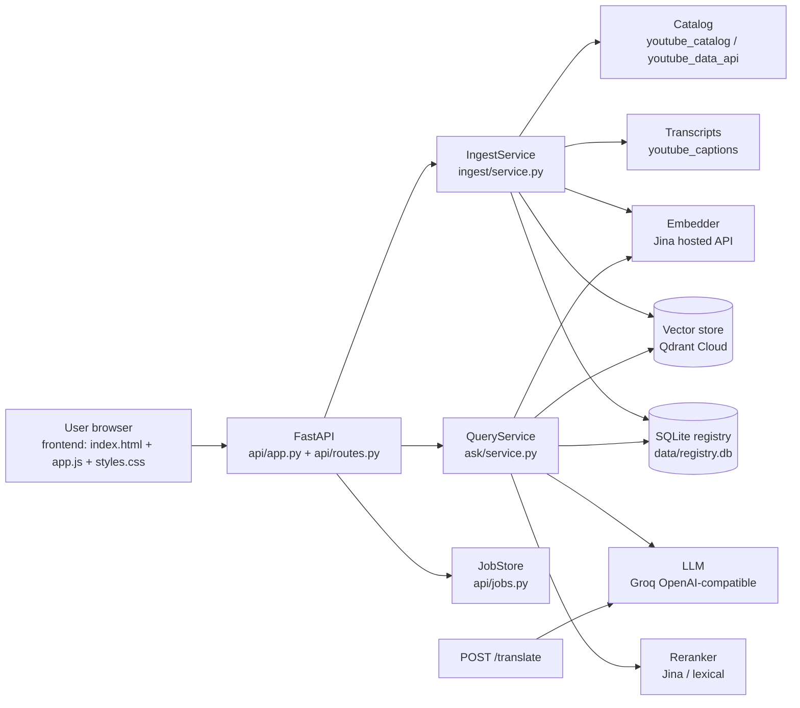
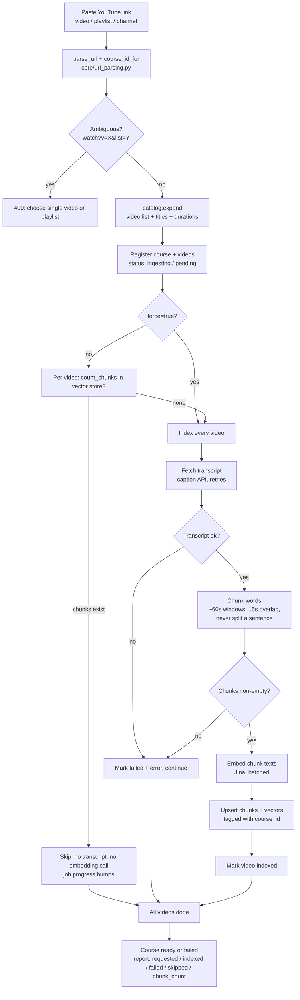
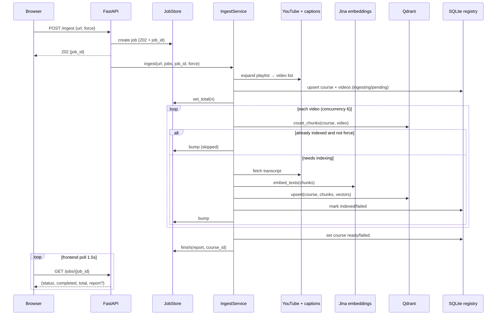
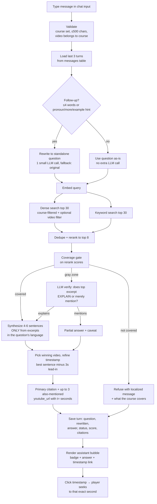
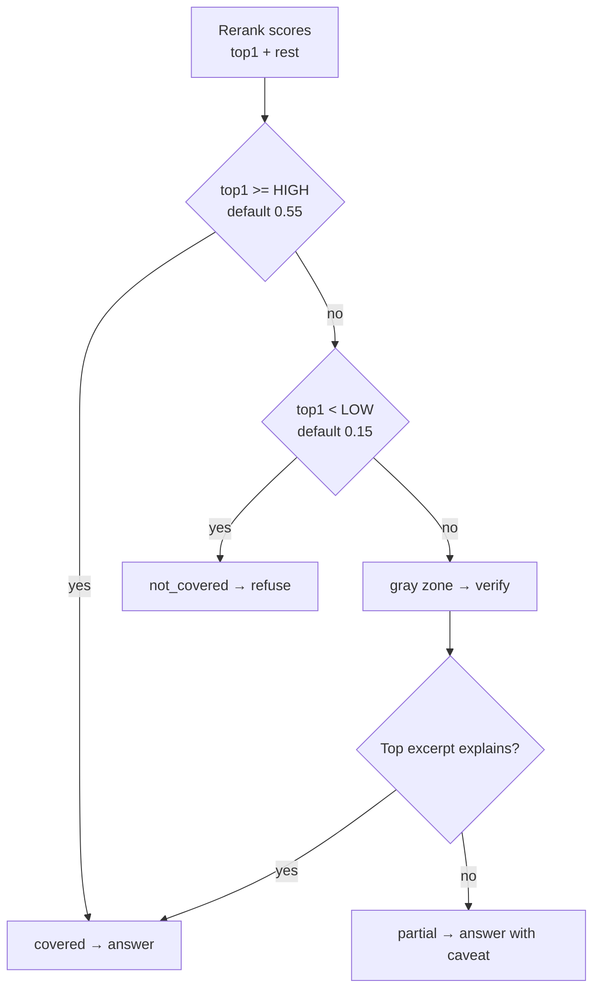
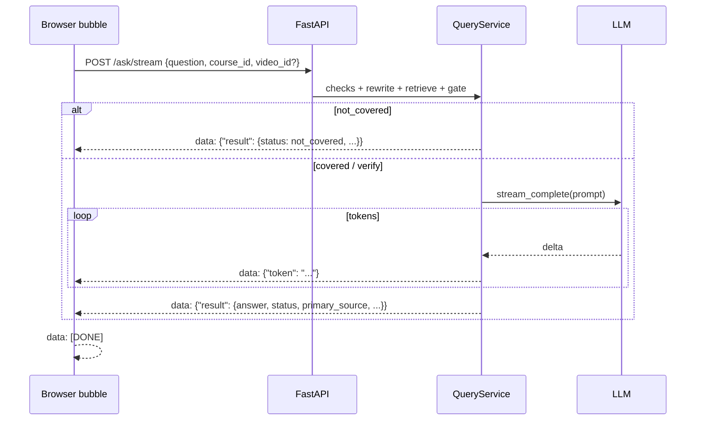
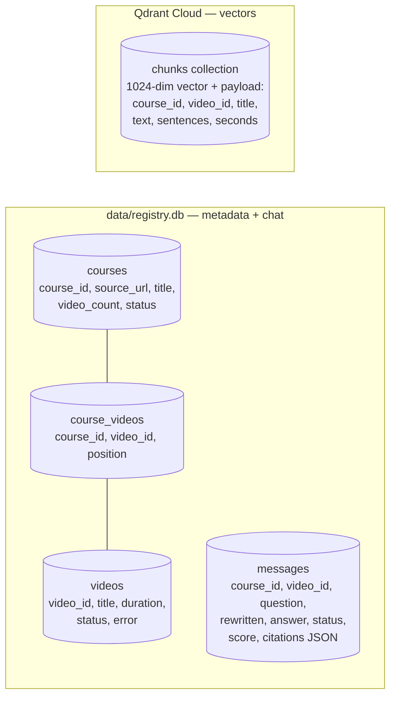

# Workflow — Video RAG, end to end

How a link becomes searchable video knowledge, and how a question becomes a
timestamped answer. Every diagram below mirrors the current code
(`backend/src/video_rag/`, `frontend/app.js`). Render the `mermaid` blocks on
GitHub or any Mermaid renderer to see the diagrams.

---

## 1. System overview



Key rule: the **vector store is the source of truth** for answers; the
**registry is bookkeeping** (Library lists, chat history, statuses). One
process serves both the API and the page (`VIDEO_RAG_FRONTEND_DIR=frontend`),
so there is no CORS and no separate frontend server.

---

## 2. Indexing workflow (ingest a link)



Notes:

- Skips are per-video, so re-pasting a playlist after a partial failure only
  indexes what is missing. `force` (checkbox / `--force` / API flag)
  re-indexes everything, e.g. after a pipeline bump.
- Registry writes never fail a job: every registry call is try/except+log.
- Progress: total is published right after catalog expansion
  (`JobStore.set_total`); the frontend polls `GET /jobs/{id}` every 1.5s.

---

## 3. Ingest sequence (who talks to whom)



---

## 4. Ask workflow (one chat question)



History is used for **rewriting only** — old answers are never fed as answer
context, so every answer stays grounded in video excerpts plus its citation.

---

## 5. Coverage gate (the refusal rule)



The refusal is a rule in code, not a model instruction — that is what makes
it reliable. `HIGH`/`LOW` are placeholders: calibrate on labelled questions
before trusting refusal behaviour.

---

## 6. Answer streaming sequence

`POST /ask/stream` runs the **same** retrieval + gate as `/ask`; only the
LLM call streams. The frontend falls back to plain `/ask` with a smooth
reveal if the stream endpoint is unreachable.



---

## 7. Translation workflow (per-answer icon)

```mermaid
flowchart TD
    A[Click translate icon<br/>on any answer bubble] --> B[Pick language<br/>inline select]
    B --> C[POST /translate<br/>{answer: ORIGINAL text, target_language}]
    C --> D{Valid + model replies?}
    D -->|no| E[Show API error in bubble<br/>answer unchanged]
    D -->|yes| F[Replace bubble text<br/>with translated answer]
    F --> G[Pick another language →<br/>re-translates from ORIGINAL]
    G --> B
    B -->|placeholder| H[Restore original text]
```

Citations are never translated — they stay separate so timestamps and links
survive in every language.

---

## 8. Chat history and Library data flow

- **One thread per course**: a single video is `course_id = video:{id}`; a
  playlist is `course_id = {playlist_id}`. Pasting an indexed link loads its
  existing thread; `Clear` deletes it (`DELETE messages`).
- **Write path**: every `/ask` and `/ask/stream` result (including refusals)
  is saved by `QueryService._save_turn` — never fatal on failure.
- **Read path**: opening a course calls `GET /courses/{id}/messages?limit=100`
  and renders user-right / assistant-left bubbles, each with its badge and
  timestamp link.
- **Library path**: `GET /courses` + `GET /courses/{id}/videos` join registry
  rows with real vector counts — a video counts as indexed only when its
  chunks exist in the store. Picking a video jumps home with that course +
  video filter applied.

---

## 9. Storage map



Jobs (`JobStore`) are the only ephemeral state (retention 3600s). Everything
else survives restarts.

---

## 10. Edge cases at a glance

| Situation | Behaviour |
| --- | --- |
| `watch?v=X&list=Y` link | `ambiguous` → 400, user picks single video or playlist |
| Re-paste indexed link | Skipped per video, previous chat reopens, zero embedding calls |
| Video has no captions | Marked `failed`, skipped, rest of course still indexes |
| Empty question / >500 chars | Rejected before any retrieval or LLM call |
| `video_id` outside course | 400 `video is not part of this course` |
| Rewrite LLM fails | Falls back to the original question |
| Stream drops mid-answer | Falls back to plain `/ask` + smooth reveal |
| Registry write fails | Logged only; job and answer continue (vectors decide) |
| Slow translate overtaken | Stale response dropped via per-bubble token |
